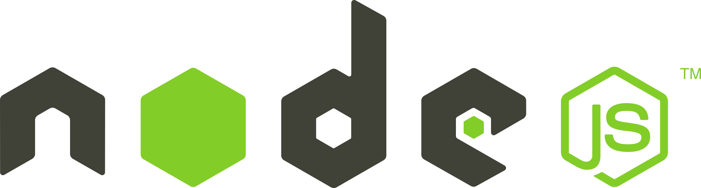

- [¿Qué es Node.js?](#qué-es-nodejs)
  - [¿Para qué se usa Node.js?](#para-qué-se-usa-nodejs)
- [npm (Node Package Manager)](#npm-node-package-manager)
  - [package.json](#packagejson)
  - [Instalación de paquetes](#instalación-de-paquetes)
  - [Opciones para paquetes de desarrollo](#opciones-para-paquetes-de-desarrollo)
  - [Opciones de npm](#opciones-de-npm)
    - [npm start](#npm-start)
    - [npm run dev](#npm-run-dev)
    - [Uso del comando "run"](#uso-del-comando-run)
    - [npx](#npx)
- [Otras utilidades](#otras-utilidades)
  - [ESLint](#eslint)
    - [Ejemplo de configuración de ESLint](#ejemplo-de-configuración-de-eslint)
  - [Prettier](#prettier)
    - [Uso de Prettier](#uso-de-prettier)
    - [Ejemplo de uso de Prettier](#ejemplo-de-uso-de-prettier)



## ¿Qué es Node.js?

Node.js es un entorno de ejecución de JavaScript del lado del servidor, construido sobre el motor de JavaScript V8 de Google Chrome. A diferencia de JavaScript en el navegador, que se ejecuta en un entorno de cliente, Node.js te permite ejecutar JavaScript en el servidor. Esto significa que puedes construir aplicaciones web y servidores utilizando JavaScript tanto en el cliente como en el servidor.

### ¿Para qué se usa Node.js?

Node.js es ampliamente utilizado para construir aplicaciones web escalables y de alto rendimiento. Algunos casos de uso comunes de Node.js incluyen:

1. Desarrollo de servidores web: Node.js proporciona un entorno rápido y eficiente para construir servidores web. Puedes crear fácilmente aplicaciones web en tiempo real, API RESTful, servidores de chat y mucho más.

2. Construcción de herramientas de línea de comandos: Node.js te permite crear herramientas de línea de comandos utilizando JavaScript. Esto es útil para automatizar tareas, procesar archivos y realizar diversas operaciones en la línea de comandos.

3. Aplicaciones de red: Node.js es ideal para construir aplicaciones de red, como servidores de tiempo real, servidores de chat, servidores de juegos y cualquier aplicación que requiera una comunicación bidireccional y en tiempo real.

## npm (Node Package Manager)

npm es el administrador de paquetes de Node.js. Viene incluido con la instalación de Node.js y te permite instalar, administrar y compartir paquetes de código reutilizables. Los paquetes son módulos de código que contienen funcionalidades específicas y pueden ser utilizados en tus proyectos.


### package.json

El archivo `package.json` es un archivo de configuración importante en un proyecto de Node.js. Contiene metadatos sobre el proyecto, como el nombre, la versión, las dependencias y los scripts personalizados.

Puedes crear un archivo `package.json` en tu proyecto ejecutando el siguiente comando en la línea de comandos:

```
npm init
```

A continuación, se te guiará a través de una serie de preguntas para configurar el archivo `package.json`. Puedes proporcionar los detalles solicitados o simplemente presionar Enter para aceptar los valores predeterminados.

### Instalación de paquetes

Para instalar paquetes en tu proyecto de Node.js, utiliza el comando `npm install`. Por ejemplo, si deseas instalar el paquete `express`, ejecuta el siguiente comando:

```
npm install express
```

Esto descargará e instalará el paquete `express` en la carpeta `node_modules` de tu proyecto. El archivo `package.json` también se actualizará automáticamente con la información del paquete instalado.

### Opciones para paquetes de desarrollo

Además de las dependencias de producción, puedes tener dependencias de desarrollo en tu proyecto. Estas son herramientas y bibliotecas que solo necesitas durante el desarrollo, como linters, compiladores, pruebas unitarias, etc.

Para instalar una dependencia de desarrollo, utiliza el comando `npm install` con la opción `--save-dev`. Por ejemplo, si deseas instalar el paquete `nodemon` para reiniciar automáticamente tu servidor durante el desarrollo, ejecuta el siguiente comando:

```
npm install nodemon --save-dev
```

Esto instalará el paquete `nodemon` como una dependencia de desarrollo y lo agregará al archivo `package.json` bajo la sección "devDependencies".

¡Claro! Aquí tienes información adicional sobre cómo crear distintas opciones en npm, como `npm start` y `npm run dev`, y por qué se utiliza el comando `run`.

### Opciones de npm

#### npm start

El comando `npm start` es una convención común utilizada en proyectos de Node.js para iniciar la aplicación. Por defecto, `npm start` ejecuta el script definido en el archivo `package.json` bajo la clave `"scripts"` y el nombre `"start"`.

Para definir el script de inicio en el archivo `package.json`, agrega lo siguiente:

```json
"scripts": {
  "start": "node index.js"
}
```

En este ejemplo, el comando `npm start` ejecutará el archivo `index.js` utilizando Node.js. Puedes personalizar el script de inicio según las necesidades de tu proyecto.

#### npm run dev

El comando `npm run dev` es una convención común utilizada para ejecutar el entorno de desarrollo de una aplicación. Al igual que con `npm start`, puedes definir el script de desarrollo en el archivo `package.json` bajo la clave `"scripts"` y el nombre `"dev"`.

Por ejemplo:

```json
"scripts": {
  "dev": "nodemon index.js"
}
```

En este caso, `npm run dev` ejecutará el archivo `index.js` utilizando `nodemon`, una herramienta que reinicia automáticamente la aplicación cuando detecta cambios en los archivos. Esto es útil durante el desarrollo, ya que no tendrás que reiniciar manualmente el servidor cada vez que realices cambios en el código.

#### Uso del comando "run"

El comando `run` se utiliza en `npm` para ejecutar los scripts definidos en el archivo `package.json`. Al utilizar `npm run`, le estás indicando a npm que ejecute un script específico en lugar de buscar un paquete instalado globalmente con ese nombre.

Por ejemplo, si tienes un script llamado `"dev"` definido en el archivo `package.json`, puedes ejecutarlo con el comando `npm run dev`. Esto asegura que npm busque y ejecute el script definido en tu proyecto en lugar de buscar un paquete global llamado `dev`.

La ventaja de utilizar `npm run` es que puedes ejecutar scripts personalizados y definidos por el usuario en el archivo `package.json`. Esto te permite automatizar tareas, como ejecutar pruebas, compilar el código fuente, limpiar archivos temporales y más.

Recuerda que para utilizar el comando `run`, no es necesario incluirlo explícitamente en los scripts definidos en el archivo `package.json`. Por ejemplo, en lugar de `"dev": "npm run nodemon index.js"`, puedes simplemente escribir `"dev": "nodemon index.js"`.

#### npx
Cuando ejecutas un comando con NPX, este busca el paquete en el registro npm y lo instala temporalmente en una ubicación local dentro de tu proyecto. Luego, ejecuta el comando del paquete instalado.

La principal ventaja de NPX es que te permite ejecutar comandos de paquetes sin tener que preocuparte por las versiones instaladas globalmente o los conflictos entre ellas. Además, también te permite probar rápidamente paquetes sin tener que instalarlos globalmente.

Aquí tienes algunos ejemplos de cómo puedes usar NPX:

1. Ejecutar un comando de un paquete específico sin instalarlo globalmente:
```
npx package-name command
```

2. Ejecutar un script definido en el archivo `package.json` de tu proyecto:
```
npx run-script script-name
```

3. Ejecutar un paquete específico en una versión determinada:
```
npx package-name@version command
```

4. Ejecutar un paquete desde un repositorio Git:
```
npx git+https://github.com/user/repo.git command
```

NPX también proporciona otras funcionalidades, como la ejecución de comandos binarios locales o la ejecución de scripts de un paquete sin necesidad de especificar el nombre del paquete.

En resumen, NPX es una herramienta útil para ejecutar comandos de paquetes de Node.js de forma temporal y localizada en tu proyecto, sin necesidad de instalarlos globalmente. Esto simplifica el manejo de dependencias y evita conflictos entre versiones.

## Otras utilidades
### ESLint
ESLint es una herramienta de linting de código para JavaScript. Su objetivo principal es detectar y reportar patrones de código problemáticos o sospechosos en tu código fuente. Te ayuda a mantener un código limpio, legible y consistente en tus proyectos.


Algunas de las características y beneficios de ESLint son:

- **Detección de errores y problemas**: ESLint analiza tu código en busca de errores comunes, como variables no utilizadas, variables no declaradas, uso incorrecto de funciones, entre otros.

- **Consistencia de código**: ESLint te permite definir y aplicar reglas de estilo de código personalizadas o utilizar conjuntos de reglas predefinidas (como las de Airbnb, Google, Standard, etc.) para mantener la consistencia en tu código.

- **Integración con herramientas de desarrollo**: ESLint se puede integrar con tu editor de código favorito o con tu flujo de trabajo de desarrollo, lo que te permite recibir retroalimentación instantánea sobre problemas de código mientras escribes.

A continuación, te explico cómo instalar y configurar ESLint en tu proyecto:

1. **Instalación**: Puedes instalar ESLint localmente en tu proyecto ejecutando el siguiente comando en la terminal, dentro de la carpeta raíz de tu proyecto:
```
npm install eslint --save-dev
```

2. **Configuración**: Después de la instalación, necesitarás configurar ESLint. Puedes generar un archivo de configuración inicial ejecutando el siguiente comando:
```
npx eslint --init
```
Esto abrirá un asistente interactivo que te guiará a través de la configuración. Puedes seleccionar un conjunto de reglas predefinidas o personalizar tus propias reglas.

3. **Uso**: Una vez que hayas configurado ESLint, puedes ejecutarlo en tu proyecto utilizando el siguiente comando:
```
npx eslint your-file.js
```
Reemplaza `your-file.js` con la ruta al archivo o carpeta que deseas analizar. ESLint mostrará los problemas encontrados en tu código y te sugerirá cómo solucionarlos.

4. **Integración con editores de código**: Para obtener una experiencia de desarrollo más fluida, puedes integrar ESLint con tu editor de código. La mayoría de los editores populares tienen extensiones o complementos disponibles para ESLint. Estas extensiones pueden mostrar los problemas de ESLint directamente en tu editor y proporcionar sugerencias mientras escribes.

5. **Personalización**: Puedes personalizar las reglas de ESLint según tus preferencias o necesidades. Puedes editar el archivo de configuración `.eslintrc.js` o `.eslintrc.json` generado en el paso 2 para agregar, modificar o desactivar reglas específicas.

Recuerda que la configuración de ESLint puede variar según tus necesidades y el tipo de proyecto en el que estés trabajando. Puedes consultar la documentación oficial de ESLint para obtener más información sobre las opciones de configuración y las reglas disponibles.

#### Ejemplo de configuración de ESLint

```javascript
module.exports = {
  env: {
    browser: true,
    es2021: true,
    node: true,
  },
  extends: [
    'eslint:recommended',
    'plugin:prettier/recommended',
  ],
  parserOptions: {
    ecmaVersion: 12,
    sourceType: 'module',
  },
  rules: {
    // Reglas personalizadas
    'no-console': 'warn',
    'no-unused-vars': 'error',
  },
};
```

En este ejemplo:

- La propiedad `env` establece el entorno en el que se ejecutará el código (navegador, ES2021 y Node.js).
- La propiedad `extends` especifica las configuraciones predefinidas que se utilizarán. En este caso, se utiliza `eslint:recommended` que incluye las reglas recomendadas por ESLint y `plugin:prettier/recommended` que integra ESLint con Prettier para formatear el código automáticamente.
- La propiedad `parserOptions` especifica las opciones del analizador de código. Aquí se establece la versión de ECMAScript (ES2021) y el tipo de módulo (module).
- La propiedad `rules` define las reglas personalizadas. En este ejemplo, se establecen dos reglas: `no-console` que muestra una advertencia si se utiliza `console.log` en el código y `no-unused-vars` que muestra un error si se declaran variables no utilizadas.

Puedes agregar, modificar o desactivar reglas según tus necesidades. Además, puedes consultar la documentación oficial de ESLint para obtener más información sobre las opciones de configuración y las reglas disponibles.

### Prettier
Prettier es una herramienta de formateo de código que te ayuda a mantener un estilo de código consistente en tus proyectos. Su objetivo principal es eliminar las discusiones sobre la forma en que se debe formatear el código, ya que Prettier aplica automáticamente un estilo de formato consistente en todo el código.


#### Uso de Prettier

1. Instalación: Primero, debes instalar Prettier en tu proyecto. Puedes hacerlo ejecutando el siguiente comando en la terminal:

   ```bash
   npm install --save-dev prettier
   ```

2. Configuración: Prettier se puede configurar utilizando un archivo de configuración `.prettierrc` en formato JSON o YAML, o mediante la sección `"prettier"` en el archivo `package.json`.

   Ejemplo de archivo `.prettierrc`:

   ```json
   {
     "semi": true,
     "singleQuote": true,
     "tabWidth": 2,
     "printWidth": 80
   }
   ```

   En este ejemplo, se configuran algunas opciones como el uso de punto y coma, comillas simples, tamaño de tabulación y ancho de línea de 80 caracteres.

3. Ejecución: Puedes ejecutar Prettier para formatear tu código utilizando el siguiente comando:

   ```bash
   npx prettier --write .
   ```

   El argumento `--write` indica que Prettier debe aplicar los cambios directamente en los archivos.

#### Ejemplo de uso de Prettier

Supongamos que tienes un archivo JavaScript llamado `index.js` con el siguiente código:

```javascript
function add(a, b) {return a+b;}
console.log(add(5,10));
```

Después de ejecutar Prettier, el código se formateará automáticamente de la siguiente manera:

```javascript
function add(a, b) {
  return a + b;
}

console.log(add(5, 10));
```

Prettier ajusta automáticamente la indentación, agrega espacios alrededor de los operadores y coloca correctamente los paréntesis.

Recuerda que Prettier se puede integrar con ESLint para obtener un formateo de código aún más completo y consistente.

# Práctica de clase: Configuración Node.js
1. Instala Nodejs, y crea un hola mundo en javascript.