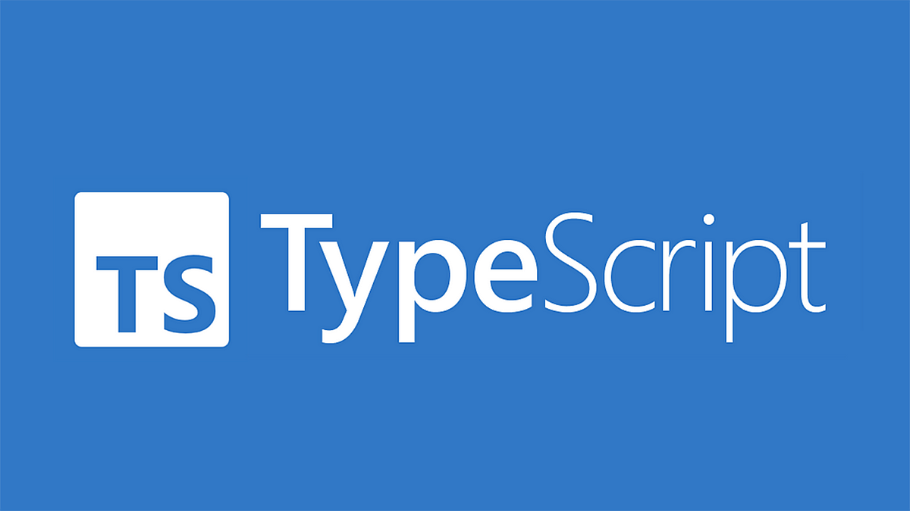

- [TypeScript](#typescript)
  - [Sistema de tipos](#sistema-de-tipos)
  - [Nulabilidad y Opcionales](#nulabilidad-y-opcionales)
    - [Optional Chaining](#optional-chaining)
  - [Programación Orientada a Objetos](#programación-orientada-a-objetos)
  - [Objetos en TypeScript](#objetos-en-typescript)
    - [Clases en TypeScript](#clases-en-typescript)
      - [Herencia](#herencia)
      - [Clases abstractas](#clases-abstractas)
      - [Constructores múltiples](#constructores-múltiples)
    - [Interfaces en TypeScript](#interfaces-en-typescript)
    - [Bucles](#bucles)
  - [Funciones](#funciones)
  - [Operadores Rest y Spread](#operadores-rest-y-spread)
    - [Operador Rest](#operador-rest)
    - [Operador Spread](#operador-spread)
  - [Asincronía en TypeScript](#asincronía-en-typescript)
  - [Operaciones con colecciones](#operaciones-con-colecciones)
- [Práctica de clase: TypeScript](#práctica-de-clase-typescript)



# TypeScript
TypeScript es un lenguaje de programación desarrollado por Microsoft que se basa en JavaScript. Añade características de tipado estático, y otras funcionalidades adicionales a JavaScript, lo que permite detectar errores en tiempo de compilación y mejorar la calidad y mantenibilidad del código.

TypeScript se compila a JavaScript, lo que significa que puedes utilizarlo en cualquier entorno que admita JavaScript, como navegadores web o servidores Node.js, a este proceso también se le llama transpilación.

TypeScript trata de resolver la mayoría de los problemas con JavaScript centrándose en mejorar la experiencia y la productividad de nosotros, los desarrolladores. Nos permite utilizar técnicas como el tipado estático opcional y/o la encapsulación para generar un código mucho más mantenible y escalable que con JavaScript tradicional, sin perder el carácter dinámico del mismo.

## Sistema de tipos
Además de los tipos String y Number, TypeScript también admite los siguientes tipos básicos:

Boolean: tipo de dato logico que representa verdadero o falso.
Array: tipo de dato estructurado que permite almacenar una colección de elementos.
Tuple: similar al array, pero con un número fijo de elementos escritos.
Enum: representa al tipo enumeración. Una enumeración es una forma de dar nombres descriptivos a los conjuntos de valores numéricos
Any: indica que la variable puede ser de cualquier tipo. Es muy útil a la hora de trabajar con librerías externas.
Void: indica que una función no devolverá ningún valor.
Never: este tipo representa el tipo de valores que nunca se producen. Por ejemplo para indicar que una función siempre arroja una excepción o que nunca termina su ejecución.

TypeScript usa inferencia de tipos para inferir los tipos de las variables cuando no se especifican. Por ejemplo, si asignamos un valor a una variable, TypeScript infiere el tipo de la variable en función del tipo del valor asignado.

Además, TypeScript una variable puede almacenar distintos tipos gracias a |, a esto se le llama unión de tipos. Por ejemplo, si queremos que una variable pueda almacenar un valor de tipo string o number.
```ts	
let age: number = 25;
let name: string = "Juan";
let isStudent: boolean = true;
let numbers: number[] = [1, 2, 3, 4, 5];
let person: object = { name: "Juan", age: 25 };
let nullableValue: string | null = null;
let anyValue: any = "Hola";
let tupleValue: [string, number] = ["Juan", 25];
enum Color { Red, Green, Blue };
let color: Color = Color.Red;
let myFunction = (param: string): void => { console.log("param")};
let unionType: string | number = "Hola";
```

## Nulabilidad y Opcionales
TypeScript permite especificar si una variable puede ser nula o no utilizando el operador null o undefined. Puedes utilizar el símbolo | para combinar varios tipos, incluyendo la posibilidad de ser nulo.
Claro, puedo explicarte la diferencia entre esas dos declaraciones en TypeScript.

1. `let nullableValue: string | null = null;`

En esta declaración, `nullableValue` es una variable de tipo `string | null`. Esto significa que puede contener tanto un valor de tipo `string` como el valor especial `null`. Al asignar `null` a `nullableValue`, estás indicando explícitamente que la variable puede ser nula.

Ejemplo de uso:
```typescript
nullableValue = "Hola"; // Asignación válida
nullableValue = null; // Asignación válida
nullableValue = 123; // Error, el tipo number no es compatible con string | null
```

2. `let nullableValue?: string;`

En esta declaración, `nullableValue` es una variable opcional de tipo `string`. Esto significa que puede contener un valor de tipo `string` o `undefined`. Al marcar la variable como opcional con el operador `?`, estás indicando que la variable puede no tener un valor asignado.

Ejemplo de uso:
```typescript
nullableValue = "Hola"; // Asignación válida
nullableValue = undefined; // Asignación válida
nullableValue = null; // Error, null no es compatible con string | undefined
nullableValue = 123; // Error, el tipo number no es compatible con string | undefined
```

En resumen, la diferencia principal entre ambas declaraciones radica en que en la primera (`string | null`) la variable puede contener tanto un valor de tipo `string` como `null`, mientras que en la segunda (`string | undefined`) la variable puede contener un valor de tipo `string` o `undefined`.

### Optional Chaining
El optional chaining es una característica introducida en TypeScript y JavaScript que te permite acceder a propiedades de un objeto de forma segura, incluso si alguna de las propiedades en la cadena de acceso es nula o indefinida.

Imaginemos que tienes un objeto `persona` con la siguiente estructura:

```typescript
const persona = {
  nombre: 'Juan',
  direccion: {
    calle: 'Calle Principal',
    ciudad: 'Ciudad de Ejemplo',
    codigoPostal: '12345'
  }
};
```

Si quieres acceder al código postal de la dirección de la persona, normalmente lo harías así:

```typescript
const codigoPostal = persona.direccion.codigoPostal;
```

Sin embargo, si por alguna razón el objeto `direccion` no está definido, obtendrías un error como "Cannot read property 'codigoPostal' of undefined". Aquí es donde entra en juego el optional chaining.

Usando el optional chaining, puedes acceder de forma segura a la propiedad `codigoPostal` incluso si `direccion` es nulo o indefinido. Para hacer esto, simplemente añade un signo de interrogación `?` después de la propiedad o el objeto que podría ser nulo:

```typescript
const codigoPostal = persona.direccion?.codigoPostal;
```

En este caso, si `direccion` es nulo o indefinido, la expresión `persona.direccion?.codigoPostal` evaluará a `undefined` en lugar de lanzar un error. Esto te permite evitar errores y manejar de manera más segura las propiedades anidadas.

Si deseas realizar una comprobación adicional, puedes encadenar múltiples propiedades opcionales:

```typescript
const codigoPostal = persona?.direccion?.codigoPostal;
```

En este ejemplo, si `persona` es nulo o indefinido, o si `direccion` es nulo o indefinido, la expresión `persona?.direccion?.codigoPostal` evaluará a `undefined`.

El optional chaining también se puede utilizar con métodos y funciones:

```typescript
const longitudNombre = persona?.nombre.length;
```

Aquí, si `persona` es nulo o indefinido, la expresión `persona?.nombre.length` evaluará a `undefined`.

El optional chaining es una herramienta útil para evitar errores en tiempo de ejecución al acceder a propiedades anidadas de objetos. Te permite escribir código más seguro y robusto al manejar casos en los que las propiedades pueden ser nulas o indefinidas.

Por otro lado, el operador lógico OR (||) se utiliza para asignar un valor por defecto cuando el valor de la izquierda es falsy (es decir, null, undefined, 0, false o una cadena vacía). Si el valor de la izquierda es falsy, se evaluará y se asignará el valor de la derecha.

Por ejemplo, si quieres asignar un valor por defecto a una variable si es nula o indefinida, puedes hacerlo así:

```typescript
const nombre = persona.nombre || 'Nombre por defecto';
```

```ts
interface Person {
  name?: string;
  age?: number;
}

function greet(person?: Person) {
  const name = person?.name || 'Guest';
  const age = person?.age || 0;

  console.log(`Hello, ${name}! You are ${age} years old.`);
}

const person1: Person = {
  name: 'John',
  age: 25
};

const person2: Person = {
  age: 30
};

greet(person1); // Output: Hello, John! You are 25 years old.
greet(person2); // Output: Hello, Guest! You are 30 years old.
greet(); // Output: Hello, Guest! You are 0 years old.
```

## Programación Orientada a Objetos

## Objetos en TypeScript
En TypeScript, puedes crear objetos utilizando la sintaxis de JavaScript. Puedes definir las propiedades y sus tipos utilizando la notación de dos puntos (:) después del nombre de la propiedad.

```ts
let person: { name: string, age: number } = {
  name: "Juan",
  age: 25
};
```

### Clases en TypeScript
Las clases en TypeScript te permiten definir objetos con propiedades y métodos. Puedes utilizar la palabra clave `class` para declarar una clase y la palabra clave `constructor` para definir el constructor de la clase.

```ts
class Person {
  name: string;
  age: number;

  constructor(name: string, age: number) {
    this.name = name;
    this.age = age;
  }

  sayHello() {
    console.log(`Hola, mi nombre es ${this.name} y tengo ${this.age} años.`);
  }
}

let person = new Person("Juan", 25);
person.sayHello();
```

En el ejemplo anterior, hemos declarado una clase `Person` con dos propiedades: `name` y `age`. El constructor de la clase toma dos parámetros, `name` y `age`, y asigna los valores pasados a las propiedades correspondientes utilizando la sintaxis `this.nombrePropiedad = valor`.

El método `sayHello` simplemente imprime un mensaje en la consola utilizando las propiedades `name` y `age` de la instancia de la clase.

Para crear una nueva instancia de la clase `Person`, utilizamos la palabra clave `new` seguida del nombre de la clase y los argumentos necesarios para el constructor. En este caso, creamos una nueva instancia de `Person` con el nombre "Juan" y la edad 25.

Una vez creada la instancia, podemos llamar al método `sayHello` utilizando la notación de punto (`person.sayHello()`), lo que imprimirá el mensaje "Hola, mi nombre es Juan y tengo 25 años." en la consola.

#### Herencia
La herencia es un concepto fundamental en la programación orientada a objetos que permite crear nuevas clases basadas en clases existentes. En TypeScript, puedes utilizar la palabra clave `extends` para establecer una relación de herencia entre dos clases.

La clase que se hereda se conoce como la clase base o superclase, mientras que la clase que hereda se conoce como la clase derivada o subclase. La clase derivada hereda todas las propiedades y métodos de la clase base y puede agregar nuevos miembros o sobrescribir los existentes.

Aquí tienes un ejemplo que muestra cómo se utiliza la herencia en TypeScript:

```ts
class Animal {
  name: string;

  constructor(name: string) {
    this.name = name;
  }

  eat() {
    console.log(`${this.name} está comiendo.`);
  }
}

class Dog extends Animal {
  breed: string;

  constructor(name: string, breed: string) {
    super(name);
    this.breed = breed;
  }

  bark() {
    console.log(`${this.name} está ladrando.`);
  }
}

let dog = new Dog("Max", "Labrador");
dog.eat(); // Output: Max está comiendo.
dog.bark(); // Output: Max está ladrando.
```

En este ejemplo, tenemos una clase base llamada `Animal` que tiene una propiedad `name` y un método `eat()`. Luego, tenemos una clase derivada llamada `Dog` que extiende la clase `Animal`. La clase `Dog` agrega una propiedad `breed` y un método `bark()`.

Al crear una instancia de `Dog`, podemos acceder tanto a las propiedades y métodos heredados de la clase `Animal` (como `name` y `eat()`) como a las propiedades y métodos propios de la clase `Dog` (como `breed` y `bark()`).

El constructor de la clase derivada `Dog` utiliza la palabra clave `super` para llamar al constructor de la clase base `Animal` y pasarle el nombre del perro. Esto asegura que la propiedad `name` de la clase base se inicialice correctamente.

La herencia te permite reutilizar código y establecer relaciones jerárquicas entre clases. Puedes crear jerarquías de herencia más complejas con múltiples niveles de clases derivadas y clases base. También puedes sobrescribir métodos de la clase base en la clase derivada para proporcionar una implementación específica para esa clase.

#### Clases abstractas
Clases abstractas
Este tipo de clases no pueden ser instanciadas ya que se usan para definir comportamientos independientemente de su concreción. Su implementación en typescript es similar a la de una clase normal con la diferencia que hay que anteponer el termino abstract antes de declararlas.

```ts
abstract class Product {
    productName : string = "Default";
    price :number = 1000;
    abstract changeName(name: string): void;

    calcPrice(){
        return this.price;
    }
}

class Mobile extends  Product {
    changeName(name : string) : void {
        this.productName = name;
    }
}

let mobProduct = new Mobile();
console.log(mobProduct);
mobProduct.changeName("Super It Product");
console.log(mobProduct);
```	

#### Modificadores de acceso

En TypeScript, los modificadores de acceso te permiten controlar la visibilidad de las propiedades y métodos de una clase. Hay tres modificadores de acceso disponibles: `public`, `private` y `protected`.

- `public`: Es el modificador de acceso por defecto. Las propiedades y métodos marcados como `public` son accesibles desde cualquier lugar, tanto dentro como fuera de la clase.

- `private`: Las propiedades y métodos marcados como `private` son accesibles solo desde dentro de la clase donde se definen. No se pueden acceder ni modificar desde fuera de la clase.

- `protected`: Las propiedades y métodos marcados como `protected` son accesibles desde la clase donde se definen y también desde las clases derivadas (herencia). No se pueden acceder ni modificar desde fuera de la clase ni desde clases no derivadas.

Aquí tienes un ejemplo que utiliza modificadores de acceso:

```ts
class Person {
  private name: string;
  protected age: number;

  constructor(name: string, age: number) {
    this.name = name;
    this.age = age;
  }

  sayHello() {
    console.log(`Hola, mi nombre es ${this.name} y tengo ${this.age} años.`);
  }
}

class Student extends Person {
  private grade: string;

  constructor(name: string, age: number, grade: string) {
    super(name, age);
    this.grade = grade;
  }

  showGrade() {
    console.log(`Mi calificación es ${this.grade}.`);
  }
}

let person = new Person("Juan", 25);
person.sayHello(); // Error: 'name' es privado en la clase 'Person'

let student = new Student("María", 20, "A");
student.sayHello(); // Acceso permitido
student.showGrade(); // Acceso permitido
```

En este ejemplo, hemos modificado la visibilidad de la propiedad `name` a `private` y la propiedad `age` a `protected`. Esto significa que la propiedad `name` solo es accesible desde dentro de la clase `Person`, mientras que la propiedad `age` es accesible desde la clase `Person` y desde la clase derivada `Student`.

Cuando intentamos acceder a la propiedad `name` en una instancia de `Person` desde fuera de la clase, obtenemos un error de compilación. Sin embargo, podemos acceder a la propiedad `age` y llamar al método `sayHello` desde la instancia de `Student`, ya que `Student` hereda de `Person`.

#### Constructores múltiples

En TypeScript, puedes definir múltiples constructores en una clase utilizando la técnica de sobrecarga de métodos. Esto te permite crear instancias de la clase con diferentes combinaciones de argumentos.

Aquí tienes un ejemplo que muestra cómo definir constructores múltiples:

```ts
class Person {
  name: string;
  age: number;

  constructor(name: string, age: number);
  constructor(name: string) {
    this.name = name;
    this.age = 0;
  }

  sayHello() {
    console.log(`Hola, mi nombre es ${this.name} y tengo ${this.age} años.`);
  }
}

let person1 = new Person("Juan", 25);
let person2 = new Person("María");

person1.sayHello(); // Output: Hola, mi nombre es Juan y tengo 25 años.
person2.sayHello(); // Output: Hola, mi nombre es María y tengo 0 años.
```

En este ejemplo, hemos definido dos constructores en la clase `Person`. El primer constructor toma dos parámetros, `name` y `age`, y asigna los valores pasados a las propiedades correspondientes. El segundo constructor toma solo un parámetro, `name`, y asigna un valor por defecto de 0 a la propiedad `age`.

Cuando creamos una nueva instancia de `Person`, podemos utilizar cualquiera de los constructores según nuestras necesidades. En el caso de `person1`, utilizamos el primer constructor y proporcionamos tanto el nombre como la edad. En el caso de `person2`, utilizamos el segundo constructor y proporcionamos solo el nombre, dejando que la edad se establezca en su valor por defecto.

De esta manera, puedes crear constructores múltiples en una clase en TypeScript para adaptarse a diferentes situaciones en las que necesites diferentes combinaciones de argumentos al crear instancias de la clase.

### Interfaces en TypeScript
Interfaces en TypeScript Las interfaces en TypeScript definen la estructura de un objeto. Puedes utilizarlas para definir la forma que debe tener un objeto y los tipos de sus propiedades. Aquí tienes un ejemplo. En typeScript, las interfaces se definen con la palabra clave interface y se suelen usar para tipar sin necesidad de crear una clase.

```ts
interface Persona {
  nombre: string;
  edad: number;
  saludar: () => void;
}

let persona1: Persona = {
  nombre: "Juan",
  edad: 25,
  saludar() {
    console.log(`Hola, mi nombre es ${this.nombre} y tengo ${this.edad} años.`);
  }
};

persona1.saludar(); // Salida: Hola, mi nombre es Juan y tengo 25 años.
```	

## Programación estructurada
### Condicionales
En TypeScript, puedes utilizar la palabra clave `if` para crear una sentencia condicional. La sintaxis de una sentencia condicional es la siguiente:

```ts
if (condition) {
  // Código a ejecutar si la condición es verdadera
} else {
  // Código a ejecutar si la condición es falsa
}
```
También podemos usar la palabra clave `else if` para comprobar múltiples condiciones:

```ts
if (condition1) {
  // Código a ejecutar si la condición 1 es verdadera
} else if (condition2) {
  // Código a ejecutar si la condición 2 es verdadera
} else {
  // Código a ejecutar si ninguna de las condiciones es verdadera
}
```

Otra opción es `switch` que nos permite evaluar una expresión y ejecutar un bloque de código dependiendo del valor de la expresión. La sintaxis de un bloque switch es la siguiente:

```ts
switch (expression) {
  case value1:
    // Código a ejecutar si expression es igual a value1
    break;
  case value2:
    // Código a ejecutar si expression es igual a value2
    break;
  default:
    // Código a ejecutar si expression no coincide con ninguno de los valores
}
```

### Bucles
En TypeScript, puedes utilizar la palabra clave `for` para crear un bucle for. La sintaxis de un bucle for es la siguiente:

```ts
for (initialization; condition; increment) {
  // Código a ejecutar en cada iteración
}
```

También puedes utilizar la palabra clave `while` para crear un bucle while. La sintaxis de un bucle while es la siguiente:

```ts
while (condition) {
  // Código a ejecutar en cada iteración
}
```

Puedes utilizar la palabra clave `do...while` para crear un bucle do...while. La sintaxis de un bucle do...while es la siguiente:

```ts
do {
  // Código a ejecutar en cada iteración
} while (condition);
```

También tenemos un bucle for...of que nos permite iterar sobre los elementos de un array. La sintaxis de un bucle for...of es la siguiente:

```ts
for (let item of array) {
  // Código a ejecutar en cada iteración
}
```

O un bucle for...in que nos permite iterar sobre las propiedades de un objeto. La sintaxis de un bucle for...in es la siguiente:

```ts
for (let property in object) {
  // Código a ejecutar en cada iteración
}
```

## Funciones
En TypeScript, puedes utilizar la palabra clave `function` para crear una función. La sintaxis de una función es la siguiente:

```ts
function functionName(parameter1: type, parameter2: type): returnType {
  // Código a ejecutar
}
```
 Podemos pasar parámetros opcionales
```ts
function functionName(parameter1: type, parameter2?: type): returnType {
  // Código a ejecutar
}
```

También podemos utilizar funciones anónimas, que son funciones sin nombre. Las funciones anónimas se utilizan a menudo como callbacks de otras funciones. La sintaxis de una función anónima es la siguiente:

```ts
function (parameter1: type, parameter2: type): returnType {
  // Código a ejecutar
}
```

También podemos utilizar funciones flecha, que son una forma más corta de escribir funciones anónimas. La sintaxis de una función flecha es la siguiente:

```ts
(parameter1: type, parameter2: type): returnType => {
  // Código a ejecutar
}
```

Aquí un ejemplo de una función que suma dos números:

```ts
function sum(a: number, b: number): number {
  return a + b;
}

let result = sum(1, 2);

console.log(result); // Output: 3

// Arrow function
const sum = (a: number, b: number): number => {
  return a + b;
}

console.log(sum(1, 2)); // Output: 3
```

Podemos pasar un numero indeterminado de parámetros a una función utilizando el operador rest (...). El operador rest se utiliza para agrupar los parámetros restantes en un array. La sintaxis del operador rest es la siguiente:

## Operadores Rest y Spread

###  Operador Rest

El operador `rest` permite agrupar un número variable de elementos en un array. Se denota con tres puntos (`...`) seguidos del nombre del parámetro. A continuación, te mostraré cómo utilizarlo en funciones:

```typescript
function sumar(...numeros: number[]): number {
  let resultado = 0;
  for (let numero of numeros) {
    resultado += numero;
  }
  return resultado;
}

console.log(sumar(1, 2, 3)); // Salida: 6
console.log(sumar(4, 5, 6, 7)); // Salida: 22
```

En el ejemplo anterior, la función `sumar` acepta un número variable de argumentos y los agrupa en el array `numeros`. Luego, itera sobre el array y suma todos los números.

También puedes utilizar el operador `rest` al desestructurar arrays:

```typescript
const numeros = [1, 2, 3, 4, 5];
const [primerNumero, segundoNumero, ...restoNumeros] = numeros;

console.log(primerNumero); // Salida: 1
console.log(segundoNumero); // Salida: 2
console.log(restoNumeros); // Salida: [3, 4, 5]
```

En este ejemplo, los primeros dos elementos del array `numeros` se asignan a las variables `primerNumero` y `segundoNumero`, respectivamente. El operador `rest` (`...restoNumeros`) captura el resto de los elementos en un nuevo array llamado `restoNumeros`.

### Operador Spread

El operador `spread` permite expandir un array en elementos individuales. También se denota con tres puntos (`...`). Aquí tienes un ejemplo de cómo utilizarlo:

```typescript
const numeros1 = [1, 2, 3];
const numeros2 = [4, 5, 6];

const numerosCombinados = [...numeros1, ...numeros2];

console.log(numerosCombinados); // Salida: [1, 2, 3, 4, 5, 6]
```

En este caso, el operador `spread` se utiliza para combinar los arrays `numeros1` y `numeros2` en un nuevo array llamado `numerosCombinados`.

También puedes utilizar el operador `spread` para crear copias de objetos y modificar sus propiedades:

```typescript
const persona = {
  nombre: 'Juan',
  edad: 30,
};

const personaModificada = { ...persona, edad: 31 };

console.log(personaModificada); // Salida: { nombre: 'Juan', edad: 31 }
```

En este ejemplo, el operador `spread` se utiliza para crear una copia del objeto `persona` y luego se modifica la propiedad `edad` en la nueva copia.

Además puedes usar el operador `spread` para pasarlos como una lista de argumentos a una función (que puede o no tener un número variable de argumentos):

```typescript
function sumar(a: number, b: number, c: number): number {
  return a + b + c;
}

const numeros = [1, 2, 3];

console.log(sumar(...numeros)); // Salida: 6
```


## Asincronía en TypeScript
TypeScript proporciona soporte para programación asíncrona utilizando promesas, async/await y callbacks.
- Callbacks: Los callbacks son funciones que se pasan como argumentos a otras funciones. Se utilizan para ejecutar código después de que se complete una operación asíncrona. Los callbacks son una forma común de manejar la asincronía en JavaScript, pero pueden conducir a un código anidado y difícil de leer, lo que se conoce como "callback hell".
```ts
function asyncFunc(callback) {
  setTimeout(() => {
    callback("¡Éxito!");
  }, 1000);
}
``` 
- Promesas: Las promesas son objetos que representan el resultado de una operación asíncrona. Puedes utilizarlas para ejecutar código después de que se complete una operación asíncrona o para manejar errores de operaciones asíncronas. Las promesas se introdujeron en ES6 y se han convertido en una forma estándar de manejar la asincronía en JavaScript.
```ts	
const promise = new Promise((resolve, reject) => {
  setTimeout(() => {
    resolve("¡Éxito!");
  }, 1000);
});

promise.then((value) => {
  console.log(value); // Output: ¡Éxito!
});

```
- async/await: El async/await es una característica introducida en ES2017 que te permite escribir código asíncrono como si fuera síncrono. Puedes utilizar la palabra clave async para marcar una función como asíncrona y la palabra clave await para esperar a que se resuelva una promesa. El código dentro de una función async se ejecuta de forma asíncrona, pero se escribe como si fuera síncrono.
```ts
const promise = new Promise((resolve, reject) => {
  setTimeout(() => {
    resolve("¡Éxito!");
  }, 1000);
});

async function asyncFunc() {
  const result = await promise;
  console.log(result); // Output: ¡Éxito!
}
```

## Operaciones con colecciones
Las más destacadas son:

1. `forEach`: Este método ejecuta una función proporcionada una vez por cada elemento de la colección.

```typescript
const numbers = [1, 2, 3, 4, 5];

numbers.forEach((number) => {
  console.log(number);
});
```

2. `map`: Este método crea un nuevo array con los resultados de aplicar una función a cada elemento de la colección.

```typescript
const numbers = [1, 2, 3, 4, 5];

const doubledNumbers = numbers.map((number) => {
  return number * 2;
});

console.log(doubledNumbers); // Output: [2, 4, 6, 8, 10]
```

3. `filter`: Este método crea un nuevo array con todos los elementos que pasan una prueba (función) proporcionada.

```typescript
const numbers = [1, 2, 3, 4, 5];

const evenNumbers = numbers.filter((number) => {
  return number % 2 === 0;
});

console.log(evenNumbers); // Output: [2, 4]
```

4. `reduce`: Este método aplica una función a un acumulador y a cada elemento de la colección (de izquierda a derecha) para reducirlo a un solo valor.

```typescript
const numbers = [1, 2, 3, 4, 5];

const sum = numbers.reduce((accumulator, number) => {
  return accumulator + number;
}, 0);

console.log(sum); // Output: 15
```

5. `find`: Este método devuelve el primer elemento de la colección que cumple con la condición proporcionada.

```typescript
const numbers = [1, 2, 3, 4, 5];

const foundNumber = numbers.find((number) => {
  return number > 3;
});

console.log(foundNumber); // Output: 4
```

6. `some`: Este método verifica si al menos un elemento de la colección cumple con la condición proporcionada.

```typescript
const numbers = [1, 2, 3, 4, 5];

const hasEvenNumber = numbers.some((number) => {
  return number % 2 === 0;
});

console.log(hasEvenNumber); // Output: true
```

7. `every`: Este método verifica si todos los elementos de la colección cumplen con la condición proporcionada.

```typescript
const numbers = [1, 2, 3, 4, 5];

const allPositive = numbers.every((number) => {
  return number > 0;
});

console.log(allPositive); // Output: true
```
# Práctica de clase: TypeScript
1. Realiza un programa en TypeScript que haga uso de la clase Funko y luego trabaje con ella usando las funciones de colecciones.