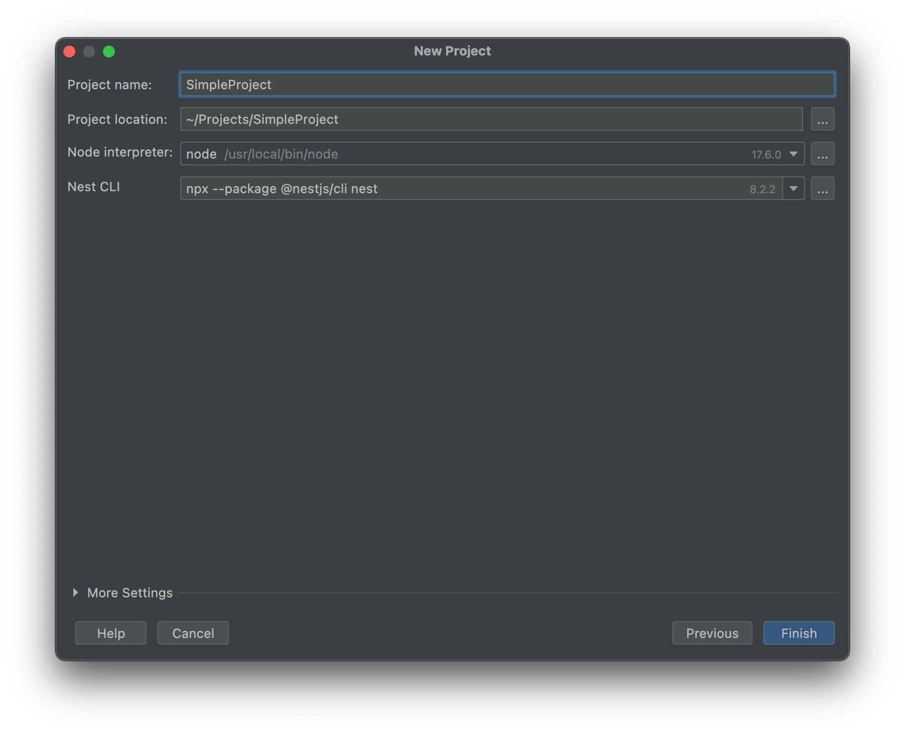

- [Nest.js](#nestjs)
  - [Instalación](#instalación)
  - [Crear un nuevo proyecto](#crear-un-nuevo-proyecto)
  - [Estructura del proyecto](#estructura-del-proyecto)
  - [Crear un componente](#crear-un-componente)
  - [Iniciar el servidor](#iniciar-el-servidor)
  - [Elementos principales](#elementos-principales)
    - [Módulos: @Module](#módulos-module)
    - [Controladores: @Controller](#controladores-controller)
    - [Providers: @Injectable](#providers-injectable)
      - [Servicios](#servicios)
  - [Manejo de Módulos e inyección de dependencias](#manejo-de-módulos-e-inyección-de-dependencias)
  - [Configurando el servicio](#configurando-el-servicio)
- [Practica de clase: Crear la base del servicio](#practica-de-clase-crear-la-base-del-servicio)


# Nest.js
[NestJS](https://nestjs.com/) es un framework NodeJS construido sobre NodeJS y TypeScript, y que hace uso de Express. Además ofrece soporte para las principales bases de datos (PostgreSQL, Oracle, SQLite, MongoDB, …​), Swagger (OpenAPI), autenticación, logging, y una arquitectura inspirada en Angular, características que lo hacen un framework bastante interesante.

NestJS a diferencia de otros frameworks en Node tiene un foco en la arquitectura. Es decir, entrega ya un proyecto de base y unas herramientas configuradas que nos permiten evitar mucho del trabajo inicial de una aplicación en NodeJS. Además se trata de una arquitectura opinada, que nos garantiza buenas prácticas, mayor homogeneidad a los proyectos de las empresas y unas guías claras para los equipos de desarrollo.

## Instalación
Antes de comenzar, asegúrate de tener Node.js y npm (Node Package Manager) instalados en tu computadora. Luego, abre tu terminal y ejecuta el siguiente comando para instalar el CLI (Command Line Interface) de Nest.js.

También te recomiendo el [plugin de IntellIJ para NestJS](https://plugins.jetbrains.com/plugin/18744-nest)

```
npm install -g @nestjs/cli
```

## Crear un nuevo proyecto
Una vez que el CLI de Nest.js esté instalado, puedes crear un nuevo proyecto ejecutando el siguiente comando en tu terminal:

```
nest new nombre-del-proyecto
```

O usando el plugin de IntellIJ.




Esto creará una nueva carpeta con la estructura básica de un proyecto Nest.js.

## Estructura del proyecto
Dentro de la carpeta de tu proyecto, encontrarás varios archivos y carpetas importantes. Algunos de los elementos clave son:

- `src`: Esta carpeta contiene el código fuente de tu aplicación Nest.js. Aquí es donde escribirás tus controladores, servicios y módulos.
- `main.ts`: Este archivo es el punto de entrada de tu aplicación. Aquí se configura y se inicia el servidor Nest.js.
- `app.module.ts`: Este archivo define el módulo raíz de tu aplicación. Aquí se importan y se configuran otros módulos, controladores y servicios.

## Crear un componente
Podemos crear un componente de Nest.js utilizando el CLI de Nest.js. Para crear un nuevo componente, ejecuta el siguiente comando en tu terminal:

```
nest generate nombre-del-componente
```
Por ejemplo para crear un controlador ejecutamos:


```
nest generate controller nombre-del-controlador
```

```typescript
import { Controller, Get } from '@nestjs/common';

@Controller('ruta')
export class NombreDelControladorController {
  @Get()
  nombreDelMetodo() {
    return '¡Hola, Nest.js!';
  }
}
```

En este ejemplo, el controlador manejará las solicitudes GET a la ruta `/ruta` y responderá con el mensaje '¡Hola, Nest.js!'.

## Iniciar el servidor
Para iniciar tu aplicación Nest.js, ejecuta el siguiente comando en tu terminal:

```
npm run start
```

Esto iniciará el servidor y podrás acceder a tu aplicación en `http://localhost:3000`.

## Elementos principales
### Módulos: @Module
 Un [módulo](https://docs.nestjs.com/modules) en Nest.js es una unidad organizativa que agrupa componentes relacionados de la aplicación. Puede contener controladores, servicios, proveedores y otros módulos. Los módulos ayudan a organizar y modularizar el código de la aplicación, lo que facilita el mantenimiento y la escalabilidad. En un módulo, se definen las dependencias y configuraciones necesarias para que los componentes funcionen correctamente. 


Un módulo está formado por:
- **Imports**: Array de dependencias a usar en el módulo de otros módulos
- **Exports**: Array de dependencias a exportar del módulo para que se usen en otros módulos
- **Controllers**: Array de controladores a usar en el módulo
- **Providers**: Array de proveedores a usar en el módulo definidos por el propio módulo.


```typescript
import { Module } from '@nestjs/common';

@Module({
  imports: [], // Array de dependencias a usar en el módulo de otros módulos
  controllers: [], // Array de controladores a usar en el módulo
  providers: [], // Array de proveedores a usar en el módulo
  exports: [], // Array de proveedores a exportar del módulo para que se usen en otros módulos
})

export class NombreDelModuloModule {}
```

### Controladores: @Controller
Los [controladores](https://docs.nestjs.com/controllers) son responsables de manejar las solicitudes HTTP entrantes y enviar las respuestas correspondientes. Un controlador es una clase decorada con el decorador `@Controller`. 


Por ejemplo:

```typescript
import { Controller, Get } from '@nestjs/common';

@Controller('ruta')
export class NombreDelControladorController {
  @Get()
  nombreDelMetodo() {
    return '¡Hola, Nest.js!';
  }
}
```
### Providers: @Injectable
En Nest.js, los [proveedores](https://docs.nestjs.com/providers) son clases o valores que pueden ser inyectados como dependencias en otros componentes, como controladores o servicios. Estos proveedores pueden ser servicios personalizados, instancias de clases, objetos literales o valores primitivos.


Los proveedores se definen en los módulos utilizando el atributo providers. Pueden ser utilizados para compartir datos, lógica o funcionalidades entre diferentes componentes de la aplicación.

Cuando un componente (como un controlador o servicio) requiere una dependencia, puede declararla en su constructor utilizando la inyección de dependencias de Nest.js. Nest.js se encargará de crear una instancia del proveedor y la inyectará automáticamente en el componente.

El decorador @Injectable se utiliza para marcar una clase como un servicio inyectable en Nest.js. Esto significa que la clase puede ser utilizada como una dependencia en otros componentes, como controladores o servicios. Cuando una clase se marca con @Injectable, Nest.js se encarga de administrar su ciclo de vida y de proporcionar una instancia de la clase cuando sea necesario. Además, @Injectable permite que el servicio sea inyectado con otras dependencias a través de la inyección de dependencias de Nest.js.

#### Servicios
Los son proveedores son clases que contienen la lógica de negocio de la aplicación. Los servicios son responsables de interactuar con la base de datos, realizar cálculos, llamar a API externas y realizar otras tareas similares. Los servicios son inyectados como dependencias en otros componentes, como controladores o servicios.


```typescript
import { Injectable } from '@nestjs/common';

@Injectable()
export class NombreDelServicioService {
  nombreDelMetodo() {
    return '¡Hola, Nest.js!';
  }
}

@Controller('ruta')
export class NombreDelControladorController {
  constructor(private final nombreDelServicioService: NombreDelServicioService) {}

  @Get()
  nombreDelMetodo() {
    return this.nombreDelServicioService.nombreDelMetodo();
  }
}
```

## Manejo de Módulos e inyección de dependencias
Una de las cosas que nos tiene que quedar clara es como se manejan los módulos y la inyección de dependencias en NestJS. Para ello vamos a crear un nuevo proyecto y vamos a ir paso a paso.

Si tienes un servicio en un módulo A y quieres usarlo en otro servicio de otro módulo B, lo más recomendado es que exportes el servicio en el módulo A y luego importes el módulo A en el módulo B. Esto te permitirá reutilizar el mismo servicio en otros módulos sin tener que duplicar tu código.

Aquí hay un ejemplo de cómo puedes hacerlo:

1. En el módulo A, exporta el servicio:

```typescript
import { Module } from '@nestjs/common';
import { ServiceA } from './serviceA.service';

@Module({
  providers: [ServiceA],
  exports: [ServiceA],
})
export class ModuleA {}
```

2. En el módulo B, importa el módulo A:

```typescript
import { Module } from '@nestjs/common';
import { ModuleA } from '../moduleA/moduleA.module';
import { ServiceB } from './serviceB.service';

@Module({
  imports: [ModuleA],
  providers: [ServiceB],
})
export class ModuleB {}
```

De esta manera, puedes inyectar el `ServiceA` en `ServiceB` como lo harías normalmente:

```typescript
import { Injectable } from '@nestjs/common';
import { ServiceA } from '../moduleA/serviceA.service';

@Injectable()
export class ServiceB {
  constructor(private serviceA: ServiceA) {}
}
```

Esto permite una gestión de dependencias más eficiente y hace que tu código sea más reutilizable y fácil de mantener. No necesitarás duplicar instancias de servicios entre módulos, lo que haría tu aplicación más difícil de testear y daría lugar a comportamientos inesperados.


## Configurando el servicio
Una de las primeras cosas que vamos a hacer es configurar el servicio leyendo de un fichero .env. Para ello vamos a instalar el paquete que nos permita leer variables de entorno.

```sh
npm install --save @nestjs/config
```

Una vez instalado, vamos a configurar el módulo principal de la aplicación para que lo use.

```typescript
import { Module } from '@nestjs/common';
import { ConfigModule } from '@nestjs/config';

@Module({
  imports: [
    // La configuración el primero
    // Cargamos el módulo de configuración donde se encuentra el archivo .env a nivel global
    ConfigModule.forRoot(),
  ],
  controllers: [AppController],
  providers: [AppService],
})
export class AppModule {}
```

Ahora podemos acceder a ellas desde cualquier punto mediante `process.env.NOMBRE_VARIABLE`.
```typescript
async function bootstrap() {
  const app = await NestFactory.create(AppModule)
  // Configuración de la versión de la API
  app.setGlobalPrefix(process.env.API_VERSION || 'v1')
  // Configuración del puerto de escucha
  await app.listen(process.env.API_PORT || 3000)
}

// Inicialización de la aplicación y cuando esté lista se muestra un mensaje en consola
bootstrap().then(() =>
  console.log(
    `🟢 Servidor escuchando en puerto: ${
      process.env.API_PORT || 3000
    } y perfil: ${process.env.NODE_ENV} 🚀`,
  ),
)
```

Poco a poco iremos descubriendo más elementos de NestJS, pero con esto ya tenemos una base para comenzar a trabajar con este framework.

# Practica de clase: Crear la base del servicio
1. Instala y configura Nestjs en tu sistema.
2. Crea un servicio de Nestjs llamado `api-funkos`.
3. Lee de un fichero .env la variable `PORT` y configura el servicio para que escuche en ese puerto.
4. Lee de un fichero .env la variable `VERSION` y configura el servicio para para que ese sea el prefijo de los endpoints.