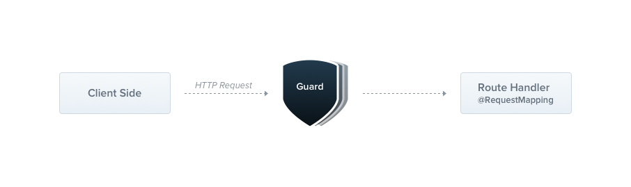

- [reación de Recurso REST: decoradores, validaciones, mapeadores y códigos de estado](#reación-de-recurso-rest-decoradores-validaciones-mapeadores-y-códigos-de-estado)
  - [Creación de recursos](#creación-de-recursos)
  - [Decoradores](#decoradores)
  - [Códigos de Respuesta](#códigos-de-respuesta)
    - [Excepciones](#excepciones)
  - [Pipes](#pipes)
  - [Guards](#guards)
  - [Validaciones](#validaciones)
  - [DTOs y Mapeadores](#dtos-y-mapeadores)
- [Práctica de clase: Funkos endpoint](#práctica-de-clase-funkos-endpoint)
- [Proyecto](#proyecto)


# reación de Recurso REST: decoradores, validaciones, mapeadores y códigos de estado

## Creación de recursos
[Nestjs te ofrece la posibilidad de hacer un endpoint completo](https://docs.nestjs.com/recipes/crud-generator) dándote la estructura gracias a su cli. Para ello solo debemos teclear: `nest g resource nombre-recurso`. Al usar este comando, NestJS generará automáticamente los archivos necesarios, incluidos el módulo, el controlador, el servicio y los archivos de prueba (spec), entidades y dtos si elegimos la opción REST y que genere todos los elementos y endpoints.

Obviamente también podemos crear cada elemento mano a mano, pero de esta manera es mucho más cómodo y rápido.

A continuación, te muestro cómo se vería la estructura generada para realizar un CRUD REST básico:

```sh
$ nest g resource productos
```
Por supuesto. Aquí tienes todo el código necesario para generar el recurso "productos" en NestJS, incluyendo el cliente de Nest para generarlo:


1. Archivo del módulo (`productos.module.ts`):
```typescript
import { Module } from '@nestjs/common';
import { ProductosController } from './productos.controller';
import { ProductosService } from './productos.service';
import { Logger } from 'nestjs-pino';

@Module({
  controllers: [ProductosController],
  providers: [ProductosService, Logger],
})
export class ProductosModule {}
```

3. Archivo del controlador (`productos.controller.ts`):
```typescript
import { Controller, Get, Post, Body, Put, Param, Delete } from '@nestjs/common';
import { ProductosService } from './productos.service';
import { Logger } from 'nestjs-pino';

@Controller('productos')
export class ProductosController {
  private readonly logger: Logger = Logger(ProductosController.name);

  constructor(private readonly productosService: ProductosService) {}

  @Get()
  findAll() {
    this.logger.log('Obteniendo todos los productos');
    return this.productosService.findAll();
  }

  @Get(':id')
  findOne(@Param('id') id: string) {
    this.logger.log(`Obteniendo producto con ID: ${id}`);
    return this.productosService.findOne(id);
  }

  @Post()
  create(@Body() data: any) {
    this.logger.log('Creando un nuevo producto');
    return this.productosService.create(data);
  }

  @Put(':id')
  update(@Param('id') id: string, @Body() data: any) {
    this.logger.log(`Actualizando producto con ID: ${id}`);
    return this.productosService.update(id, data);
  }

  @Delete(':id')
  delete(@Param('id') id: string) {
    this.logger.log(`Eliminando producto con ID: ${id}`);
    return this.productosService.delete(id);
  }
}
```

4. Archivo del servicio (`productos.service.ts`):
```typescript
import { Injectable } from '@nestjs/common';
import { Logger } from 'nestjs-pino';

@Injectable()
export class ProductosService {
  private productos = []; // Aquí se almacenarán los productos, debes usar una base de datos real en un entorno de producción

  constructor(private readonly logger: Logger) {}

  findAll() {
    this.logger.log('Obteniendo todos los productos');
    return this.productos;
  }

  findOne(id: string) {
    this.logger.log(`Obteniendo producto con ID: ${id}`);
    return this.productos.find(producto => producto.id === id);
  }

  create(data: any) {
    this.logger.log('Creando un nuevo producto');
    const producto = { id: Date.now().toString(), ...data };
    this.productos.push(producto);
    return producto;
  }

  update(id: string, data: any) {
    this.logger.log(`Actualizando producto con ID: ${id}`);
    const index = this.productos.findIndex(producto => producto.id === id);
    if (index !== -1) {
      this.productos[index] = { ...this.productos[index], ...data };
      return this.productos[index];
    }
    return null;
  }

  delete(id: string) {
    this.logger.log(`Eliminando producto con ID: ${id}`);
    const index = this.productos.findIndex(producto => producto.id === id);
    if (index !== -1) {
      const productoEliminado = this.productos[index];
      this.productos.splice(index, 1);
      return productoEliminado;
    }
    return null;
  }
}
```

## Decoradores
Un decorador en TypeScript es una función que se adjunta a una declaración (clase, método, propiedad, etc.) y proporciona metadatos adicionales o modifica el comportamiento de esa declaración. Los decoradores se aplican utilizando la sintaxis `@nombreDelDecorador` justo encima de la declaración que se desea decorar.

En el contexto de un controlador REST en NestJS, los decoradores son esenciales para definir las rutas y los métodos HTTP que manejará el controlador. A continuación, te muestro los decoradores más importantes utilizados en un controlador REST en NestJS:

1. `@Controller('ruta')`: Este decorador se utiliza para definir la ruta base para todas las rutas en un controlador. La ruta especificada se concatenará con las rutas definidas en los controladores y determinará la ruta completa para acceder a las operaciones CRUD.

2. `@Get()`, `@Post()`, `@Put()`, `@Delete()`, etc.: Estos decoradores se utilizan para definir los métodos HTTP que manejará el controlador. Se colocan encima de los métodos en el controlador y especifican la ruta relativa para cada operación. Por ejemplo, `@Get()` se usará para manejar las peticiones HTTP de tipo GET.

3. `@Param()`, `@Body()`, `@Query()`, etc.: Estos decoradores se utilizan para capturar y manipular datos desde los parámetros de ruta, el cuerpo de la solicitud o los parámetros de la consulta. Los decoradores `@Param()`, `@Body()`, y `@Query()` se utilizan comúnmente para acceder a los parámetros de una solicitud, mientras que otros decoradores como `@Req()` y `@Res()` se utilizan para acceder al objeto de solicitud y al objeto de respuesta respectivamente. Para actualizar solo un objeto parcial podemos usar `@Body() product:Partial<Product>`. O definir la Entidad como `export class UpdateProductDto extends PartialType(ProductDto) {}`

4. `@UseGuards(Guardia)`: Este decorador se utiliza para aplicar un "guardia" (middleware) a una ruta o a todo el controlador. Los guardias se utilizan para interceptar y validar las solicitudes antes de que lleguen a los controladores, lo que permite realizar tareas como autenticación, autorización o verificaciones personalizadas.

5. `@UseInterceptors(Interceptor)`: Este decorador se utiliza para aplicar un "interceptor" a una ruta o a todo el controlador. Los interceptores se utilizan para modificar la solicitud o la respuesta en algún punto del ciclo de vida de la solicitud, lo que permite realizar tareas como el registro, la transformación de datos o la manipulación de respuestas.

6. `@Injectable`: Este decorador se utiliza para marcar una clase como un elemento inyectable en NestJS. Esto significa que la clase puede ser utilizada como una dependencia en otros componentes, como controladores o servicios. Cuando una clase se marca con `@Injectable`, NestJS se encarga de administrar su ciclo de vida y de proporcionar una instancia de la clase cuando sea necesario. Además, `@Injectable` permite que el servicio sea inyectado con otras dependencias a través de la inyección de dependencias de NestJS.

Estos son solo algunos de los decoradores más importantes utilizados en un controlador REST en NestJS. Hay muchos otros decoradores disponibles en NestJS que proporcionan funcionalidades adicionales, como el manejo de excepciones, la validación de datos, el cacheo, entre otros.

## Códigos de Respuesta
En NestJS, puedes enviar códigos de estado HTTP específicos usando decorador @HttpCode() en los métodos del controlador. Por ejemplo, si deseas enviar un código de estado 201 en lugar del código de estado predeterminado 200, puedes usar el decorador @HttpCode(201) en el método del controlador.

```typescript
@Post()
@HttpCode(201)
create(@Body() data: any) {
  return this.productosService.create(data);
}
```

### Excepciones
Además, en NestJS, tenemos una serie de Excepciones ya preparadas para ser usadas desde la lógica del un servicio o controlador, entre las muchas podemos destacar:
- `BadRequestException`: Excepción de error de solicitud incorrecta (400).
- `UnauthorizedException`: Excepción de error de autenticación (401).
- `NotFoundException`: Excepción de error de recurso no encontrado (404).
- `MethodNotAllowedException`: Excepción de error de método no permitido (405).
- `NotAcceptableException`: Excepción de error de contenido no aceptable (406).

Se recomiendan usar en el servicio y no en el controlador, ya que el controlador debe ser lo más limpio posible y delegar la lógica al servicio. Por ejemplo:

```typescript
import { Injectable, NotFoundException } from '@nestjs/common';

@Injectable()
export class ProductosService {
  private productos = []; // Aquí se almacenarán los productos, debes usar una base de datos real en un entorno de producción

  findAll() {
    return this.productos;
  }

  findOne(id: string) {
    const producto = this.productos.find(producto => producto.id === id);
    if (!producto) {
      throw new NotFoundException(`Producto con ID: ${id} no encontrado`);
    }
    return producto;
  }

  create(data: any) {
    const producto = { id: Date.now().toString(), ...data };
    this.productos.push(producto);
    return producto;
  }

  update(id: string, data: any) {
    const index = this.productos.findIndex(producto => producto.id === id);
    if (index !== -1) {
      this.productos[index] = { ...this.productos[index], ...data };
      return this.productos[index];
    }
    return null;
  }

  delete(id: string) {
    const index = this.productos.findIndex(producto => producto.id === id);
    if (index !== -1) {
      const productoEliminado = this.productos[index];
      this.productos.splice(index, 1);
      return productoEliminado;
    }
    return null;
  }
}
```
## Pipes
Los [pipes](https://docs.nestjs.com/pipes) son una característica muy útil de NestJS que nos permite validar y transformar los datos de entrada antes de que lleguen a los controladores. Los pipes se pueden usar para validar los datos de entrada, transformar los datos de entrada en un formato deseado o realizar cualquier otra tarea personalizada. Los pipes se pueden aplicar a los parámetros de ruta, al cuerpo de la solicitud o a los parámetros de la consulta.


Por ejemplo, si queremos que un id sea un número, podemos usar el pipe ParseIntPipe, que transforma el string a un número. Si no es un número, lanza una excepción BadRequestException.

Un "pipe" es una clase que lleva el decorador `@Injectable()` y que implementa la interfaz `PipeTransform`. Esta interfaz define un solo método, `transform()`, que toma los argumentos que se le pasen a la función del controlador y los procesa de alguna manera.

Puedes usar "pipes" en NestJS para dos casos de uso principalmente: 

1. Transformación: modificar los datos de entrada para que tengan el formato que deseamos. Por ejemplo, puedes tener un pipe que convierte un string a un número entero.

2. Validación: verificar los datos de entrada y, si son válidos, permitir que pasen sin cambios. Si no son válidos, el pipe puede lanzar una excepción.

Un aspecto importante a tener en cuenta es que los "pipes" se ejecutan justo antes de que se invoque el método del controlador. Esto significa que todas las operaciones de transformación o validación se realizan en ese momento. Así puedes asegurarte de que el método del controlador recibe los argumentos adecuados y validados.

NestJS proporciona varios "pipes" incorporados que ya puedes usar, como `ValidationPipe`, `ParseIntPipe`, `ParseFloatPipe`, `ParseBoolPipe`, `ParseArrayPipe`, `ParseUUIDPipe`, `ParseEnumPipe`, `DefaultValuePipe`, y `ParseFilePipe`. Cada uno de estos realiza una función específica, como parsear un valor a int, float, boolean, array, UUID, enum, proporcionar un valor predeterminado si no se proporciona ningún valor, o parsear archivos, respectivamente.

Por ejemplo, si queremos que un id sea un número, podemos usar el pipe `ParseIntPipe`, que transforma el string a un número. Si no es un número, lanza una excepción `BadRequestException`. O si es un UUID podemos usar el pipe `ParseUUIDPipe`.


```typescript
@Get(':id')
findOne(@Param('id', ParseIntPipe) id: number) {
  return this.productosService.findOne(id);
}

@Get(':id')
findOne(@Param('id', ParseUUIDPipe) id: string) {
  return this.productosService.findOne(id);
}
```

## Guards
Los [Guards](https://docs.nestjs.com/guards) en NestJS son una forma de agregar lógica adicional antes de que se ejecute el controlador de manejo de rutas. Pueden determinar si una solicitud debe ser manejada por la ruta o no, basándose en cualquier lógica que definas. Esto los hace útiles para la autenticación, la autorización, la validación de datos, y más.

Puedes ver un ejmeplo de us uso en el apartado de almacenamiento para evitar que un fichero se suba si no existe el producto asociado a la id que se le pasa en la ruta y como vita que se suba el fichero si no pasa la guarda.



Un guard es una clase que implementa la interfaz `CanActivate`. Esta interfaz tiene un solo método llamado `canActivate` que debe ser implementado por la clase guard. Este método puede devolver un booleano o una promesa que resuelve un booleano.

Aquí te dejo un ejemplo de un guard simple que siempre permite el acceso:

```typescript
import { Injectable, CanActivate, ExecutionContext } from '@nestjs/common';

@Injectable()
export class AlwaysAllowGuard implements CanActivate {
  canActivate(
    context: ExecutionContext,
  ): boolean | Promise<boolean> {
    return true;  // Siempre permitimos el acceso
  }
}
```

Para usar este guard, puedes agregarlo a cualquier controlador o método de controlador usando el decorador `@UseGuards()`. Aquí te dejo un ejemplo de cómo hacerlo:

```typescript
import { Controller, UseGuards, Get } from '@nestjs/common';
import { AlwaysAllowGuard } from './always-allow.guard';

@Controller('cats')
@UseGuards(AlwaysAllowGuard)
export class CatsController {
  @Get()
  findAll() {
    return 'This action returns all cats';
  }
}
```

En este ejemplo, `AlwaysAllowGuard` se aplica a todas las rutas manejadas por `CatsController`. Si quisieras aplicarlo solo a una ruta específica, podrías hacerlo así:

```typescript
@Controller('cats')
export class CatsController {
  @UseGuards(AlwaysAllowGuard)
  @Get()
  findAll() {
    return 'This action returns all cats';
  }
}
```

En este caso, `AlwaysAllowGuard` se aplica solo a la ruta GET en `CatsController`.

## Validaciones
NestJS proporciona un [módulo de validación](https://docs.nestjs.com/techniques/validation#auto-validation) que se puede usar para validar los datos de entrada en los controladores. Este módulo se basa en la biblioteca de validación de clase de class-validator y class-transformers, que nos permite validar en base a [decoradores de validación](https://github.com/typestack/class-validator#validation-decorators).

Lo primero que tenemos que hacer es instalar las dependencias necesarias:

```sh
$ npm install --save class-validator class-transformer
```

Luego las activamos globalmente para todo nuestro servicio.
  
  ```typescript
  import { ValidationPipe } from '@nestjs/common';
  import { NestFactory } from '@nestjs/core';
  import { AppModule } from './app.module';

  async function bootstrap() {
    const app = await NestFactory.create(AppModule);
    app.useGlobalPipes(new ValidationPipe());
    await app.listen(3000);
  }
  bootstrap();
  ```

Ahora podemos usar los decoradores de validación en nuestras entidades y DTOs. Por ejemplo, si queremos que un id sea un número, podemos usar la anotación `@IsInt()` de class-validator, que valida que el valor sea un número entero. Si no es un número, lanza una excepción `BadRequestException`, que podemos capturar y manejar en nuestro controlador.


```ts
// Ejemplo de uso de decradores para validar un producto
import { IsInt, IsString, IsNotEmpty, IsNumber, IsOptional, IsUUID, IsEnum } from 'class-validator';
import { PartialType } from '@nestjs/mapped-types';

export enum TipoProducto {
  LIBRO = 'libro',
  PELICULA = 'pelicula',
  SERIE = 'serie',
  VIDEOJUEGO = 'videojuego',
}

export class CreateProductDto {
  @IsNotEmpty()
  @IsString()
  readonly nombre: string;

  @IsNotEmpty()
  @IsString()
  readonly descripcion: string;

  @IsNotEmpty()
  @IsNumber()
  readonly precio: number;

  @IsNotEmpty()
  @IsInt()
  readonly stock: number;

  @IsNotEmpty()
  @IsEnum(TipoProducto)
  readonly tipo: TipoProducto;
}
```

## DTOs y Mapeadores
Supongamos que tienes una aplicación Nest que se encarga de gestionar usuarios. Puedes usar mapeadores y DTOs para separar la representación interna de los usuarios en la base de datos (entidades) de su representación externa en las API (DTOs).

Los mapeadors pueden ser un método del servicio, pueden ser un propio Provider.

Por supuesto, puedo mostrarte cómo crear un mapeador como un provider en Nest.js. 

Vamos a modificar el ejemplo anterior para crear un mapeador de usuarios como un provider llamado `UserMapper`. 

Primero, crea un nuevo archivo llamado `user.mapper.ts` y agrega el siguiente código:

```typescript
import { Injectable } from '@nestjs/common';
import { User } from './user.entity';
import { UserDTO } from './user.dto';

@Injectable()
export class UserMapper {
  mapToDTO(user: User): UserDTO {
    const dto = new UserDTO();
    dto.id = user.id;
    dto.username = user.username;
    dto.email = user.email;
    return dto;
  }
}
```

El método `plainToClass` es una función proporcionada por la biblioteca `class-transformer` que se utiliza para convertir un objeto plano (plain object) en una instancia de una clase con todos los decoradores, tipos y validaciones definidos en esa clase.

Cuando utilizas `plainToClass`, puedes proporcionar una clase como primer argumento y un objeto plano como segundo argumento. La función realizará la transformación adecuada, asignando correctamente los valores al objeto de la clase con las validaciones y los tipos definidos.

Por ejemplo, supongamos que tienes la siguiente clase:

```typescript
class Persona {
  @IsString()
  nombre: string;

  @IsNumber()
  edad: number;
}
```

Y tienes un objeto plano sin validaciones:

```typescript
const plainPersona = {
  nombre: "John Doe",
  edad: 25
};
```

Puedes utilizar `plainToClass` para convertir el objeto plano en una instancia de la clase `Persona`:

```typescript
const persona = plainToClass(Persona, plainPersona);
```

Después de la ejecución de esta línea, `persona` será una instancia de la clase `Persona` con los valores asignados y las validaciones aplicadas. Puedes usarlo para hacer el mapper.

Una vez tengas el mapper lo lo añadimos al módulo:

```typescript
import { Module } from '@nestjs/common';
import { UserMapper } from './user.mapper';

@Module({
  providers: [UserMapper, UserService],
  controllers: [UserController]
})
export class AppModule {}
```

Luego, modifica el servicio de usuarios `user.service.ts` para inyectar y utilizar el mapeador:

```typescript
import { Injectable } from '@nestjs/common';
import { User } from './user.entity';
import { UserDTO } from './user.dto';
import { UserMapper } from './user.mapper';

@Injectable()
export class UserService {
  private users: User[] = [];

  constructor(private readonly userMapper: UserMapper) {}

  async createUser(userDTO: UserDTO): Promise<UserDTO> {
    const newUser = new User(userDTO.username, userDTO.email);
    newUser.id = this.users.length + 1;
    this.users.push(newUser);
    return this.userMapper.mapToDTO(newUser);
  }

  async getAllUsers(): Promise<UserDTO[]> {
    return this.users.map(this.userMapper.mapToDTO);
  }
}
```

En este ejemplo, hemos creado un nuevo provider `UserMapper` que se encarga de la lógica de mapeo entre la entidad `User` y el DTO `UserDTO`. Luego, lo hemos inyectado en el servicio de usuarios mediante la dependencia en su constructor.

Esta separación de responsabilidades nos permite tener un código más modular y fácil de mantener. Ahora, el servicio de usuarios se encarga de la lógica de negocio y utiliza el mapeador para convertir las entidades en DTOs.

Recuerda registrar el mapeador `UserMapper` en el módulo correspondiente para que Nest.js pueda inyectarlo correctamente en el servicio de usuarios.

Por otro lado podemos usar librerías específicas como [AutoMapper](https://medium.com/@exfabrica/nestjs-dto-with-automapper-c4e89009f30b). 


# Práctica de clase: Funkos endpoint
1. Vamos a crear un endpoint para gestionar los Funkos de nuestra tienda. Para ello, vamos a crear un recurso llamado `funkos` que nos permita realizar las operaciones CRUD sobre los Funkos de nuestra tienda.
2. Añade un logger para ser usado.
3. El servicio debe ser con una lista para ser usado.
4. Ajusta excepciones y códigos de respuesta.
5. Añade las validaciones usando pipes y decoradores de clase.

# Proyecto
Puedes consultar esta parte en [el proyecto de ejemplo](https://github.com/joseluisgs/DesarrolloWebEntornosServidor-03-Proyecto-2023-2024/releases/tag/productos_categorias).