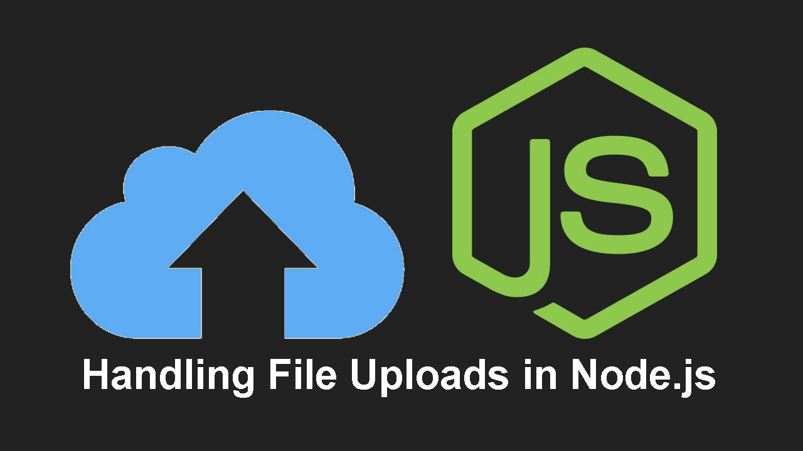

- [Almacenamiento de Ficheros](#almacenamiento-de-ficheros)
  - [Subiendo ficheros](#subiendo-ficheros)
  - [Personalizando FileInterceptor](#personalizando-fileinterceptor)
  - [Inicializando el Sistema de almacenamiento](#inicializando-el-sistema-de-almacenamiento)
  - [Devolviendo una fichero subido](#devolviendo-una-fichero-subido)
  - [Uso de Guards para comprobar que el id existe antes de almacenar el fichero](#uso-de-guards-para-comprobar-que-el-id-existe-antes-de-almacenar-el-fichero)
- [Testeando el sistema de almacenamiento](#testeando-el-sistema-de-almacenamiento)
  - [Servicios](#servicios)
  - [Testeando el controlador](#testeando-el-controlador)
  - [Testeando e2e](#testeando-e2e)
- [Práctica de clase: Almacenamiento de Ficheros](#práctica-de-clase-almacenamiento-de-ficheros)
- [Proyecto](#proyecto)



# Almacenamiento de Ficheros
Para almacenar ficheros, [Nestjs nos ofrece total transparencia con Multer](https://docs.nestjs.com/techniques/file-upload).

Lo primero que debemos hacer es instalar los tipos de Multer
```bash
npm install --save @types/multer
```

## Subiendo ficheros

A partir de aquí podemos usar los [Interceptadores](https://docs.nestjs.com/interceptors). En NestJS, un interceptor es una clase que se utiliza para interceptar y modificar el flujo de ejecución de una solicitud entrante antes de que llegue al controlador correspondiente o después de que se haya completado la respuesta. Los interceptores se pueden utilizar para realizar tareas comunes de manera centralizada, como la transformación de datos, la validación, el registro, la autorización, el manejo de errores, entre otros.


`FileInterceptor` y `@UploadedFile` son funcionalidades proporcionadas por el módulo `@nestjs/platform-express` para facilitar la carga de archivos en NestJS.

`FileInterceptor` es un interceptor predefinido que se utiliza para interceptar y procesar la carga de archivos en una ruta específica. Se utiliza para manejar la lógica relacionada con la carga de archivos, como almacenar los archivos en un directorio, generar nombres de archivo únicos, validar el tipo de archivo, entre otras tareas.

En el ejemplo que proporcionaste:

```typescript
@Post('upload')
@UseInterceptors(FileInterceptor('file'))
uploadFile(@UploadedFile() file: Express.Multer.File) {
  console.log(file);
}
```

- `@Post('upload')` define una ruta `POST` en la cual se realizará la carga de archivos. La ruta será `/upload` en este caso.

- `@UseInterceptors(FileInterceptor('file'))` aplica el interceptor `FileInterceptor` a la ruta `POST` para manejar la carga de archivos. El parámetro `'file'` especifica el nombre del campo en el formulario de carga de archivos.

- `@UploadedFile()` es un decorador utilizado en el controlador para obtener el archivo cargado. En este caso, se declara el parámetro `file` de tipo `Express.Multer.File` para recibir el archivo cargado. Puedes acceder a diferentes propiedades del archivo, como `file.filename`, `file.originalname`, `file.mimetype`, etc.

Dentro del método `uploadFile`, se realiza un simple `console.log(file)` para imprimir la información del archivo cargado.

En resumen, `FileInterceptor` y `@UploadedFile` son funcionalidades de NestJS que simplifican el manejo de la carga de archivos en una ruta específica. `FileInterceptor` se encarga de procesar la carga de archivos, mientras que `@UploadedFile` se utiliza para obtener el archivo cargado en el controlador.

## Personalizando FileInterceptor
Para personalizar el comportamiento de `FileInterceptor`, puedes pasar un objeto de opciones como segundo parámetro al llamarlo. Aquí tienes algunas opciones comunes que puedes utilizar:

- `storage`: Define el almacenamiento para los archivos subidos. Puedes utilizar el método `diskStorage` del módulo `multer` para especificar la carpeta de destino y el nombre del archivo.

- `fileFilter`: Permite filtrar los archivos que se aceptan o rechazan en función de su tipo o cualquier otra condición personalizada. Puedes proporcionar una función que reciba la solicitud (`req`), el archivo (`file`) y un callback (`cb`). El callback debe llamarse con un error si el archivo no cumple con los criterios de filtrado, o con `null` y un valor booleano (`true` o `false`) para indicar si el archivo es aceptado o no.

- `limits`: Permite establecer límites en el tamaño del archivo y el número máximo de archivos permitidos. Puedes especificar el tamaño máximo del archivo en bytes utilizando la propiedad `fileSize` y el número máximo de archivos utilizando la propiedad `files`.

- `preservePath`: Permite conservar la estructura de directorios original del archivo subido en lugar de aplanarla. Esto es útil si deseas mantener la estructura de carpetas del cliente al guardar los archivos.

Aquí tienes un ejemplo de cómo personalizar `FileInterceptor` con algunas de estas opciones:

```typescript
import { FileInterceptor } from '@nestjs/platform-express';
import { diskStorage } from 'multer';

// ...

@UseInterceptors(
  FileInterceptor('file', {
    storage: diskStorage({
      destination: './uploads',
      filename: (req, file, cb) => {
        const uniqueName = generateUniqueName(); // Lógica para generar un nombre único
        const fileExtension = getFileExtension(file.originalname);
        const fileName = `${uniqueName}.${fileExtension}`;
        cb(null, fileName);
      },
    }),
    fileFilter: (req, file, cb) => {
      if (isValidFile(file)) {
        cb(null, true);
      } else {
        cb(new Error('Invalid file type'), false);
      }
    },
    limits: {
      fileSize: 1024 * 1024, // 1 MB
      files: 1, // Permitir solo un archivo
    },
    preservePath: true,
  }),
)
```
## Inicializando el Sistema de almacenamiento
Si queremos inicializar el sistema de almacenamiento, podemos hacerlo haciendo uso de `onModuleInit()`. Este método se ejecutará cuando se cargue el módulo correspondiente.

```typescript
// Este método se ejecuta cuando el módulo se inicia
  // En este caso, si estamos en entorno de desarrollo, se eliminan los archivos
  // del directorio de uploads y se crea de nuevo.
  // Esto es para que cada vez que se inicie el servidor, el directorio esté vacío.
  async onModuleInit() {
    if (this.isDev) {
      if (fs.existsSync(this.uploadsDir)) {
        this.logger.log(`Eliminando ficheros de ${this.uploadsDir}`)
        fs.readdirSync(this.uploadsDir).forEach((file) => {
          fs.unlinkSync(path.join(this.uploadsDir, file))
        })
      } else {
        this.logger.log(
          `Creando directorio de subida de archivos en ${this.uploadsDir}`,
        )
        fs.mkdirSync(this.uploadsDir)
      }
    }
  }
```

## Devolviendo una fichero subido
Para devolver una fichero subido, podemos hacerlo de la siguiente manera usando `Response`de Express:

```typescript
 @Get(':filename')
  getFile(@Param('filename') filename: string, @Res() res: Response) {
    const file = join(
      process.cwd(), // process.cwd() devuelve el directorio de trabajo actual
      process.env.UPLOADS_DIR || './storage-dir', // directorio de subida de archivos
      filename, // nombre del archivo
    )

    // Comprobamos si existe el fichero
    if (fs.existsSync(file)) {
      this.logger.log(`Fichero encontrado ${file}`)
      res.sendFile(file)
    } else {
      throw new NotFoundException(`El fichero ${filename} no existe.`)
    }
  }
```
Te recomiendo que te lleves toda la lógica al Servicio y no al controlador.

## Uso de Guards para comprobar que el id existe antes de almacenar el fichero
Al usar el sistema de Nestjs, el fichero se almacena antes de ejecutar la lógica del servicio. Esto quiere decir que si queremos asignar una imagen a un producto y este no existe, almacenamos la imagen y luego lanzamos la excepción.

Es por ello que es recomendable usar un [guard](https://docs.nestjs.com/guards) para comprobar que el id existe antes de almacenar el fichero. Para ello podemos usar el siguiente guard, que se le pasa el servicio de productos

```typescript
@Injectable()
export class ProductoExistsGuard implements CanActivate {
  constructor(private readonly productosService: ProductosService) {}

  async canActivate(context: ExecutionContext): Promise<boolean> {
    const request = context.switchToHttp().getRequest()
    const id = request.params.id
    const producto = await this.productosService.findOne(id)
    if (!producto) {
      throw new NotFoundException(`El producto con id ${id} no existe`)
    }
    return true
  }
}
```

Ahora en nuestro Controlador en el metodo patch, podemos usarlo
  
  ```typescript
  @Patch('imagen/:id')
  @UseGuards(ProductoExistsGuard)
  @UseInterceptors(
    FileInterceptor('file', {
      storage: diskStorage({
        destination: './uploads',
        filename: (req, file, cb) => {
          const uniqueName = generateUniqueName()
          const fileExtension = getFileExtension(file.originalname)
          const fileName = `${uniqueName}.${fileExtension}`
          cb(null, fileName)
        },
      }),
      fileFilter: (req, file, cb) => {
        if (isValidFile(file)) {
          cb(null, true)
        } else {
          cb(new Error('Invalid file type'), false)
        }
      },
      limits: {
        fileSize: 1024 * 1024, // 1 MB
        files: 1, // Permitir solo un archivo
      },
      preservePath: true,
    }),
  )
  async updateImage(
    @Param('id') id: number,
    @UploadedFile() file: Express.Multer.File,
    @Req() req: Request,
  ): Promise<ResponseProductoDto> {
    const producto = await this.productosService.updateImage(
      id,
      file,
      req,
      true,
    )
    return this.mapper.toResponseDto(producto)
  }
  ```

# Testeando el sistema de almacenamiento

## Servicios
Para testear unitariamente el servicio, puedes mockear los elementos que consideres. Por ejemplo si estoy testeando un servicio de productos que usa el servicio de almacenamiento puedo crear un mock del mismo.

```typescript
const storageServiceMock = {
    removeFile: jest.fn(),
    getFileNameWithouUrl: jest.fn(),
  }
```

Y luego 
```ts
describe('updateImage', () => {
    it('should update a producto image', async () => {
      const mockRequest = {
        protocol: 'http',
        get: () => 'localhost',
      }
      const mockFile = {
        filename: 'new_image',
      }

      const mockProductoEntity = new ProductoEntity()
      const mockResponseProductoDto = new ResponseProductoDto()

      jest.spyOn(service, 'exists').mockResolvedValue(mockProductoEntity)

      jest
        .spyOn(productoRepository, 'save')
        .mockResolvedValue(mockProductoEntity)

      jest
        .spyOn(mapper, 'toResponseDto')
        .mockReturnValue(mockResponseProductoDto)

      expect(
        await service.updateImage(1, mockFile as any, mockRequest as any, true),
      ).toEqual(mockResponseProductoDto)

      expect(storageService.removeFile).toHaveBeenCalled()
      expect(storageService.getFileNameWithouUrl).toHaveBeenCalled()
    })
```

## Testeando el controlador
En este caso mockeamos nuestro servicio, con el método nuevo
```ts
 describe('updateImage', () => {
    it('should update a producto image', async () => {
      const mockId = 1
      const mockFile = {} as Express.Multer.File
      const mockReq = {} as Request
      const mockResult: ResponseProductoDto = new ResponseProductoDto()

      jest.spyOn(service, 'updateImage').mockResolvedValue(mockResult)

      await controller.updateImage(mockId, mockFile, mockReq)
      expect(service.updateImage).toHaveBeenCalledWith(
        mockId,
        mockFile,
        mockReq,
        true,
      )
      expect(mockResult).toBeInstanceOf(ResponseProductoDto)
    })
 })
``` 

## Testeando e2e
Procedemos como siempre, mockemos el servicio con su nuevo método y hacemos la petición pasándole el fichero como petición multiparte,
  
  ```ts
 describe('PATCH /productos/imagen/:id', () => {
    it('should update the product image', async () => {
      const file = new Buffer('file')

      mockProductosService.updateImage.mockResolvedValue(myProductoResponse)

      await request(app.getHttpServer())
        .patch(`${myEndpoint}/imagen/${myProductoResponse.id}`)
        .attach('file', file, 'image.jpg')
        .set('Content-Type', 'multipart/form-data')
        .expect(200)
    })
 })
 ```
  
# Práctica de clase: Almacenamiento de Ficheros
1. Crea el sistema de almacenamiento para subir imágenes a los Funkos.
2. Permite consultar y devolver la imagen de un Funko.
3. Testea los nuevos elementos tanto a nivel unitario como e2e.

# Proyecto
Puedes consultar esta parte en [el proyecto de ejemplo](https://github.com/joseluisgs/DesarrolloWebEntornosServidor-03-Proyecto-2023-2024/releases/tag/storage).