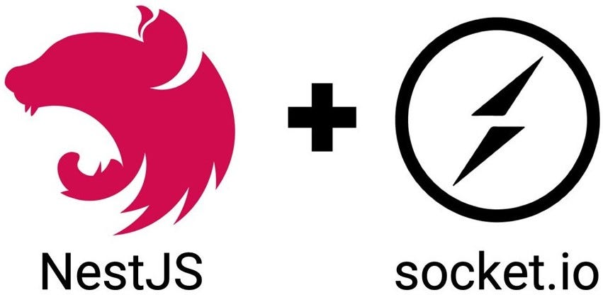
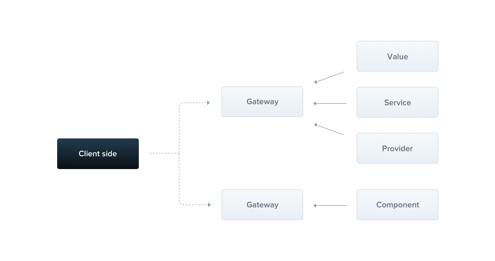
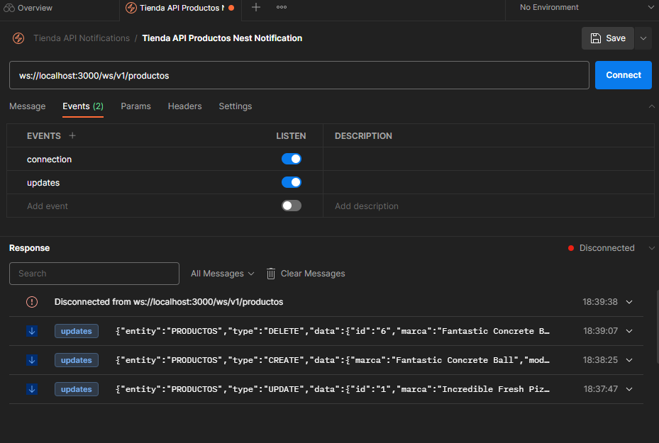

- [Websockets](#websockets)
  - [Instalación y configuración en Nestjs](#instalación-y-configuración-en-nestjs)
  - [Getaway](#getaway)
  - [Uso de Postman](#uso-de-postman)
- [Práctica de clase: Almacenamiento de Ficheros](#práctica-de-clase-almacenamiento-de-ficheros)
- [Proyecto](#proyecto)



# Websockets
Un WebSocket es un protocolo de comunicación bidireccional en tiempo real que se establece entre un cliente y un servidor a través de una conexión persistente. A diferencia del protocolo HTTP, que sigue un modelo de solicitud-respuesta, los WebSockets permiten una comunicación continua y en tiempo real entre el cliente y el servidor.

El protocolo WebSocket utiliza una conexión TCP única para enviar y recibir mensajes en formato de texto o binario. Esto permite una comunicación eficiente y de baja latencia, lo que lo hace ideal para aplicaciones en tiempo real como chats, juegos en línea, notificaciones en tiempo real, entre otros.

La conexión WebSocket se establece mediante un proceso de handshake (apretón de manos) HTTP/HTTPS inicial, donde el cliente y el servidor acuerdan utilizar el protocolo WebSocket. Una vez establecida la conexión, tanto el cliente como el servidor pueden enviar mensajes en cualquier momento sin necesidad de realizar solicitudes adicionales.

[Nestjs](https://docs.nestjs.com/websockets/gateways) hace uso de [Socket.io](https://socket.io/). Socket.io es una biblioteca de JavaScript que permite la comunicación en tiempo real entre clientes y servidores a través de websockets. Proporciona una capa de abstracción sobre los websockets y otros mecanismos de transporte, lo que facilita la implementación de aplicaciones en tiempo real permitiendo la suscripción mediante eventos.

## Instalación y configuración en Nestjs
Para poder instalar los websockets necesitamos:
```bash
$ npm i --save @nestjs/websockets @nestjs/platform-socket.io
```

## Getaway
En Nest.js, un WebSocket [Gateway](https://docs.nestjs.com/websockets/gateways#gateways) (o también conocido como Gateway de WebSockets) es una clase especial que se encarga de manejar las conexiones WebSocket y las interacciones entre el servidor y los clientes WebSocket. 

El concepto de un WebSocket Gateway es una abstracción proporcionada por la arquitectura de Nest.js para simplificar el manejo de WebSockets en la aplicación. Proporciona un conjunto de decoradores y métodos que facilitan la implementación de la lógica de WebSocket, como el manejo de conexiones, desconexiones y envío de mensajes a los clientes conectados.



Aquí hay algunas razones por las cuales los WebSockets se utilizan generalmente junto con un WebSocket Gateway:

1. Manejo de eventos: Los WebSockets son conexiones bidireccionales y persistentes. Un WebSocket Gateway permite la administración centralizada de las conexiones WebSocket, así como el manejo de eventos y acciones que ocurren en tiempo real. Esto facilita el envío de mensajes y notificaciones a los clientes y la sincronización de datos en tiempo real.

2. Abstracción de WebSocket: Al utilizar un WebSocket Gateway, puedes aprovechar las funcionalidades proporcionadas por el framework Nest.js para trabajar con WebSockets, como decoradores para manejar eventos, inyección de dependencias y una estructura de aplicación coherente.

3. Integración con la aplicación principal: Un WebSocket Gateway se puede integrar fácilmente en la aplicación principal de Nest.js, lo que permite una integración limpia con el resto de la lógica de la aplicación, incluyendo los controladores, servicios y otros módulos.

En resumen, un WebSocket Gateway en Nest.js proporciona una capa de abstracción y funcionalidad adicional sobre los WebSockets, facilitando su manejo y permitiendo una implementación más sencilla de la lógica en tiempo real en tu aplicación.

Para crear un WebSocket Gateway en Nest.js, debes crear una clase anotada con `@WebSocketGateway` y su módulo que la incluya, puedes usar el CLI de Nestjs. En esta clase se define los métodos que se utilizan para manejar eventos de conexión, desconexión y manejo de mensajes (envío y recepción) en base a los eventos que se definan. También proporciona un conjunto de decoradores que se utilizan para definir los eventos que se manejarán en el WebSocket Gateway.

Puedes fijar el namespace o ruta del websocket. La anotación` @WebSocketServer()` se utiliza para inyectar el servidor Socket.IO en el servicio. Esto permite acceder al servidor WebSocket y utilizar métodos como emit() para enviar mensajes a los clientes conectados.

```ts

const ENDPOINT: string = `/ws/${process.env.API_VERSION || 'v1'}/productos`

@WebSocketGateway({
  namespace: ENDPOINT,
})
export class ProductsNotificationsGateway {
  @WebSocketServer()
  private server: Server

  private readonly logger = new Logger(ProductsNotificationsGateway.name)

  constructor() {
    this.logger.log(`ProductsNotificationsGateway is listening on ${ENDPOINT}`)
  }

  // envia notificación a todos en el evento updates
  sendMessage(notification: any) {
    this.server.emit('updates', notification)
  }

  private handleConnection(client: Socket) {
    // Este método se ejecutará cuando un cliente se conecte al WebSocket
    this.logger.debug('Cliente conectado:', client.id)
    this.server.emit(
      'connection',
      'Updates Notifications WS: Productos - Tienda API NestJS',
    )
  }

  private handleDisconnect(client: Socket) {
    // Este método se ejecutará cuando un cliente se desconecte del WebSocket
    console.log('Cliente desconectado:', client.id)
    this.logger.debug('Cliente desconectado:', client.id)
  }

  // Si quiero leer lo que llega y reenviarlo
  @SubscribeMessage('updateProduct') // el evento al que me suscribo para escuchar
  handleUpdateProduct(client: Socket, data: any) {
    // Aquí puedes manejar la lógica para procesar la actualización del producto
    // y enviar la notificación a todos los clientes conectados
    const notification = {
      message: 'Se ha actualizado un producto',
      data: data,
    };

    this.server.emit('updates', notification);
  }
}
```

Ya en este momento podemos usarlo cuando quedamos, solo debemos importar el módulo del Websocket en donde queremos usarlo, y usarlo donde queramos
  
  ```ts	
  @Injectable()
export class ProductosService {
  private readonly logger: Logger = new Logger(ProductosService.name)

  // Inmyectamos el repositorio de la entidad ProductoEntity
  constructor(
    @InjectRepository(ProductoEntity)
    private readonly productoRepository: Repository<ProductoEntity>,
    private readonly productosMapper: ProductosMapper,
    private readonly productsNotificationsGateway: ProductsNotificationsGateway,
  ) {}

  
  async create(
    createProductoDto: CreateProductoDto,
  ): Promise<ResponseProductoDto> {
    this.logger.log('Create producto ${createProductoDto}')
    const productoCreated = await this.productoRepository.save(productoToCreate)
    const dto = this.productosMapper.toResponseDto(productoCreated)
    this.onChange(NotificacionTipo.CREATE, dto)
    return dto
  }

  private onChange(tipo: NotificacionTipo, data: ResponseProductoDto) {
    const notificacion = new Notificacion<ResponseProductoDto>(
      'PRODUCTOS',
      tipo,
      data,
      new Date(),
    )
    // Lo enviamos
    this.productsNotificationsGateway.sendMessage(notificacion)
  }
}
```


## Uso de Postman
Para poder usar esta funcionalidad con [Postman](https://blog.postman.com/postman-now-supports-socket-io/), debemos crear una conexión de Socket.io y suscribirnos al evento que queramos escuchar,



# Práctica de clase: Almacenamiento de Ficheros
1. Crea el sistema de notificaciones para recibir en tu cliente en tiempo real cuando se crea, se actualiza o elimina un Funko.
2. Crea los test que sean necesarios para probar la nueva funcionalidad.
3. Prueba los notificaciones con Postman.

# Proyecto
Puedes consultar esta parte en [el proyecto de ejemplo](https://github.com/joseluisgs/DesarrolloWebEntornosServidor-03-Proyecto-2023-2024/releases/tag/websockets).