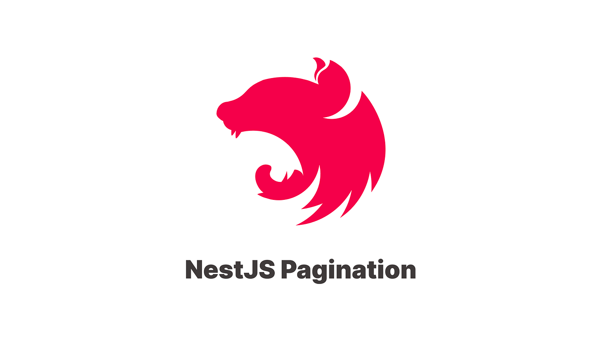

- [Endpoints avanzado: cache, paginación, filtros y ordenaciones](#endpoints-avanzado-cache-paginación-filtros-y-ordenaciones)
  - [Cache](#cache)
    - [Instalación de paquetes](#instalación-de-paquetes)
    - [Configuración de la cache](#configuración-de-la-cache)
    - [Auto-cache](#auto-cache)
    - [Cache en controlador vs Cache en servicio](#cache-en-controlador-vs-cache-en-servicio)
  - [Testing](#testing)
    - [Servicio](#servicio)
- [Paginación, ordenación y búsqueda](#paginación-ordenación-y-búsqueda)
  - [Instalación](#instalación)
  - [Controlador](#controlador)
  - [Servicio](#servicio-1)
    - [Relaciones](#relaciones)
    - [Filtros](#filtros)
    - [Testing](#testing-1)
- [Práctica de clase: Cache, Paginación y mejoras en búsquedas](#práctica-de-clase-cache-paginación-y-mejoras-en-búsquedas)
- [Proyecto](#proyecto)



# Endpoints avanzado: cache, paginación, filtros y ordenaciones

## Cache
La cache nos permite acelerar la obtención de resultados. Para ello [Netsjs nos ofrece distintos enfoques](https://docs.nestjs.com/techniques/caching) para trata la cache.

### Instalación de paquetes

Antes de nada deberemos instalar los paquetes necesarios para trabajar con la cache, adicionalmente podemos instalar otros que nos permiten usar métodos o sistemas alternativos. En nuestro caso usaremos el sistema por defecto de NestJS (In-Memory Cache).
  
```bash	
$ npm install @nestjs/cache-manager cache-manager
```

### Configuración de la cache
Podemos configurar la cache directamente en nuestro módulo de la aplicación, en nuestro caso en el módulo principal `app.module.ts`:

```typescript
import { Module } from '@nestjs/common';
import { CacheModule } from '@nestjs/cache-manager';
import { AppController } from './app.controller';

@Module({
  imports: [CacheModule.register()],
  controllers: [AppController],
})
export class AppModule {}
```

Una vez configurada la cache, podemos usarla en nuestros controladores o servicios. Para ello, deberemos inyectarla en el constructor de la clase:

```typescript
constructor(@Inject(CACHE_MANAGER) private cacheManager: Cache) {}
```

Una vez inyectada, podemos usarla en nuestros métodos. Por ejemplo, en nuestro servicio:

```typescript
const value = await this.cacheManager.get('key'); // Obtener un valor
await this.cacheManager.set('key', 'value'); // Establecer un valor
await this.cacheManager.del('key'); // Eliminar un valor
```

***OJO*** Es importante que la key sea única para cada objeto que queramos cachear.

### Auto-cache 
Podemos activar el auto cache para los métodos `GET` en nuestro controlador gracias al interceptador `CacheInterceptor`. Para ello, deberemos añadirlo en nuestro controlador:

```typescript
@Controller()
@UseInterceptors(CacheInterceptor)
export class AppController {
  @Get()
  findAll(): string[] {
    return [];
  }
}
```

En NestJS, un interceptor es una característica que te permite interceptar y modificar el flujo de ejecución de una solicitud antes de que llegue al controlador o después de que salga del controlador. Los interceptores se utilizan para realizar acciones comunes de manera centralizada, como la validación de datos, la transformación de respuestas, el registro de solicitudes, la gestión de errores, la autenticación, la autorización, entre otros.


### Cache en controlador vs Cache en servicio

La decisión de utilizar la caché a nivel del controlador o del servicio depende en gran medida de la estructura de tu aplicación y de tus necesidades específicas.

- Caché a nivel de controlador: Si utilizas la caché a nivel del controlador, estarías almacenando en caché los datos que se devuelven directamente a través de las respuestas HTTP. Esto puede ser útil si quieres reducir la carga en tu servidor y acelerar las respuestas a las solicitudes HTTP. Sin embargo, si tienes múltiples controladores que utilizan el mismo servicio y necesitas que los datos estén siempre actualizados, la caché a nivel del controlador podría no ser la mejor opción, ya que cada controlador tendría su propia versión de los datos en caché. Es fácil de implementar y usar gracias al uso de anotaciones.

- Caché a nivel de servicio: Si utilizas la caché a nivel del servicio, estarías almacenando en caché los datos que se obtienen a través de las operaciones de tu servicio. Esto puede ser útil si tienes operaciones que son costosas en términos de tiempo o recursos y quieres evitar realizarlas repetidamente. Además, si tienes múltiples controladores que utilizan el mismo servicio, la caché a nivel de servicio asegurará que todos los controladores utilicen la misma versión de los datos en caché. Te da más control sobre cuándo y cómo se almacenan los datos en caché. Sin embargo, puede ser más complicado de implementar, ya que necesitas gestionar la caché manualmente.

En general, si tienes operaciones costosas que se realizan en tus servicios y que se utilizan en múltiples controladores, puede ser más beneficioso utilizar la caché a nivel del servicio. Por otro lado, si estás más interesado en acelerar las respuestas a las solicitudes HTTP y las operaciones de tu servicio no son particularmente costosas, podría ser más beneficioso utilizar la caché a nivel del controlador.

Por último, es importante tener en cuenta que la caché no es una solución mágica que mejora automáticamente el rendimiento de tu aplicación. Debes utilizarla con prudencia y comprender bien cuándo y cómo utilizarla para obtener los mejores resultados

La decisión de implementar la caché a nivel de controlador o de servicio depende en gran medida de la estructura de tu aplicación y de tus necesidades específicas. Aquí te dejo algunos puntos a considerar:

En general, si estás buscando una solución fácil para mejorar el rendimiento de tus respuestas HTTP, la caché a nivel de controlador puede ser una buena opción. Sin embargo, si necesitas un control más granular sobre la caché, o si tus servicios realizan operaciones costosas que quieres optimizar, entonces la caché a nivel de servicio puede ser la mejor opción.

Además, no hay nada que te impida utilizar ambas técnicas en la misma aplicación. Por ejemplo, podrías utilizar la caché a nivel de servicio para optimizar las operaciones costosas dentro de tus servicios, y luego utilizar la caché a nivel de controlador para almacenar las respuestas HTTP y acelerar las respuestas a las solicitudes HTTP.

## Testing
### Servicio
Podemos mockear su funcionamiento y pasar este mock en el módulo de test
```ts
// Mock con los métodos, ojo que son promesas
const cacheManagerMock = {
    get: jest.fn(() => Promise.resolve()),
    set: jest.fn(() => Promise.resolve()),
    store: {
      keys: jest.fn(),
    },
    del: jest.fn(() => Promise.resolve()),
  }
beforeEach(async () => {
    // Creamos un módulo de prueba de NestJS que nos permitirá crear una instancia de nuestro servicio.
    const module: TestingModule = await Test.createTestingModule({
      // Proporcionamos una lista de dependencias que se inyectarán en nuestro servicio.
      providers: [
        CategoriasService,
        {
          provide: getRepositoryToken(CategoriaEntity), 
          useClass: Repository, 
        },
        { provide: CACHE_MANAGER, useValue: cacheManagerMock },
      ],
    }).compile() // Compilamos el módulo de prueba.

    service = module.get<CategoriasService>(CategoriasService) // Obtenemos una instancia de nuestro servicio.
    // getRepositoryToken es una función de NestJS que se utiliza para generar un token de inyección de dependencias para un repositorio de TypeORM.
    repo = module.get<Repository<CategoriaEntity>>(
      getRepositoryToken(CategoriaEntity),
    ) // Obtenemos una instancia de nuestro repositorio de categorías.
    mapper = module.get<CategoriasMapper>(CategoriasMapper) // Obtenemos una instancia de nuestro mapper de categorías.
    cacheManager = module.get<Cache>(CACHE_MANAGER) // Obtenemos una instancia del caché
  })
```

Ahora en cada método podemos mockear el funcionamiento de get, set y del
```ts
it('should return a list of categories', async () => {
      // Mock the cacheManager.get() method to return a list of categories
      jest.spyOn(cacheManager, 'get').mockResolvedValueOnce([testCategory])

      // Call the findAll() method
      const result = await service.findAll()

      // Expect the result to be an array of categories
      expect(result).toEqual([testCategory])
    })
```


# Paginación, ordenación y búsqueda
[Nest Paginate](https://www.npmjs.com/package/nestjs-paginate) es una biblioteca de paginación para NestJS que facilita la implementación de la paginación en tus aplicaciones con TypeORM y basada en [JSON:API](https://jsonapi.org/). 

Proporciona una forma sencilla de manejar la paginación de resultados en las consultas a bases de datos o cualquier otra fuente de datos.

## Instalación
Para utilizar Nest Paginate en tu proyecto NestJS, sigue estos pasos:

Instala la biblioteca `nestjs-paginate` utilizando npm:

```
npm install nestjs-paginate
```
## Controlador

Utiliza la función `Paginate()` en tus controladores o servicios para implementar la paginación. Esta función acepta un `PaginateQuery`.

Esta esta formada por los campos:
- page?: number, número de pagina
- limit?: number, límite de pagina
- sortBy?: [string, string][], campo y criterio de ordenacion (ASC|DESC)
- searchBy?: string[], criterio usado para buscar
- search?: string , criterio de búsqueda
- filter?: { [column: string]: string | string[] }, filtro y tipo de filtro
- select?: string[], columnas a mostrar
- path: string, el path

Por ejemplo en esta url: `http://localhost:3000/cats?limit=5&page=2&sortBy=color:DESC&search=i&filter.age=$gte:3&select=id,name,color,age`

Tenemos:
- limit: 5
- pagina: 2
- sortBy: color:DESC
- search: i (que contenga la i)
- filter: age: $gte:3 (edad mayor o igual que 3)
- select: id, name, color, age (datos a mostrar)
  
```typescript
@Controller('cats')
export class CatsController {
  constructor(private readonly catsService: CatsService) {}

  @Get()
  public findAll(@Paginate() query: PaginateQuery): Promise<Paginated<CatEntity>> {
    return this.catsService.findAll(query)
  }
}
```

## Servicio
En nuestro servicio definimos el método `findAll()` que recibe el `PaginateQuery` y devuelve un `Promise<Paginated<T>>`:

```typescript
public findAll(query: PaginateQuery): Promise<Paginated<CatEntity>> {
    return paginate(query, this.catsRepository, {
      sortableColumns: ['id', 'name', 'color', 'age'],
      nullSort: 'last',
      defaultSortBy: [['id', 'DESC']],
      searchableColumns: ['name', 'color', 'age'],
      select: ['id', 'name', 'color', 'age', 'lastVetVisit'],
      filterableColumns: {
        name: [FilterOperator.EQ, FilterSuffix.NOT],
        age: true,
      },
  })
```

Definimos lo que queramos que no sea por defecto
- sortableColumns: columnas por las que se puede ordenar
- nullSort: si es null, como se ordena
- defaultSortBy: ordenación por defecto
- searchableColumns: columnas por las que se puede buscar
- select: columnas por las que se puede seleccionar
- filterableColumns: columnas por las que se puede filtrar y tipo de filtro si se quiere acotar

### Relaciones
Podemos usarlo con `QueryBuilder`
  
```typescript	
const queryBuilder = repo
  .createQueryBuilder('cats')
  .leftJoinAndSelect('cats.owner', 'owner')
  .where('cats.owner = :ownerId', { ownerId })

const result = await paginate<CatEntity>(query, queryBuilder, config)
```

Podemos usar Relations, como forma alternativa para hacer un left-join 
```typescript
// http://localhost:3000/cats?filter.toys.name=$in:Mouse,String

const config: PaginateConfig<CatEntity> = {
  relations: ['toys'],
  sortableColumns: ['id', 'name', 'toys.name'],
  filterableColumns: {
    'toys.name': [FilterOperator.IN],
  },
}

const result = await paginate<CatEntity>(query, catRepo, config)
```

O lo podemos usar con relaciones embebidas o anidadas
```typescript
const config: PaginateConfig<CatEntity> = {
  relations: { home: { pillows: true } },
  sortableColumns: ['id', 'name', 'home.pillows.color'],
  searchableColumns: ['name', 'home.pillows.color'],
  filterableColumns: {
    'home.pillows.color': [FilterOperator.EQ],
  },
}

const result = await paginate<CatEntity>(query, catRepo, config)
```

### Filtros
Aquí tienes ejemplos de filtros
```
?filter.name=$eq:Milo es equivalente a ?filter.name=Milo

?filter.age=$btw:4,6 donde la columna age está entre 4 y 6

?filter.id=$not:$in:2,5,7 donde la columna id no es 2, 5 o 7

?filter.summary=$not:$ilike:term donde la columna summary no contiene el término "term"

?filter.summary=$sw:term donde la columna summary comienza con el término "term"

?filter.seenAt=$null donde la columna seenAt es NULL

?filter.seenAt=$not:$null donde la columna seenAt no es NULL

?filter.createdAt=$btw:2022-02-02,2022-02-10 donde la columna createdAt está entre las fechas 2022-02-02 y 2022-02-10

?filter.createdAt=$lt:2022-12-20T10:00:00.000Z donde la columna createdAt es anterior a la fecha ISO 2022-12-20T10:00:00.000Z

?filter.roles=$contains:moderator donde la columna roles es un array y contiene el valor "moderator"

?filter.roles=$contains:moderator,admin donde la columna roles es un array y contiene los valores "moderator" y "admin"
```

### Testing
A la hora de testear, debes crear las simulaciones de los datos de entrada para PageQuery y de salida para Paginated. Para ello.

```typescript
it('should return a page of categories', async () => {
      // Create a mock PaginateQuery object
      const paginateOptions = {
        page: 1,
        limit: 10,
        path: 'categorias',
      }

      // Mock the paginate method to return a Paginated object
      const testCategories = {
        data: [],
        meta: {
          itemsPerPage: 10,
          totalItems: 1,
          currentPage: 1,
          totalPages: 1,
        },
        links: {
          current: 'categorias?page=1&limit=10&sortBy=nombre:ASC',
        },
      } as Paginated<CategoriaEntity>

        // Debemos simular la consulta que se hace con paginate
      const mockQueryBuilder = {
        take: jest.fn().mockReturnThis(),
        skip: jest.fn().mockReturnThis(),
        addOrderBy: jest.fn().mockReturnThis(),
        getManyAndCount: jest.fn().mockResolvedValue([testCategories, 1]),
      }

      jest
        .spyOn(repo, 'createQueryBuilder')
        .mockReturnValue(mockQueryBuilder as any)

      // Call the findAll method
      const result: any = await service.findAll(paginateOptions)

      // console.log(result)
      expect(result.meta.itemsPerPage).toEqual(paginateOptions.limit)
      // Expect the result to have the correct currentPage
      expect(result.meta.currentPage).toEqual(paginateOptions.page)
      // Expect the result to have the correct totalPages
      expect(result.meta.totalPages).toEqual(1) // You may need to adjust this value based on your test case
      // Expect the result to have the correct current link
      expect(result.links.current).toEqual(
        `categorias?page=${paginateOptions.page}&limit=${paginateOptions.limit}&sortBy=nombre:ASC`,
      )
    })
```	

# Práctica de clase: Cache, Paginación y mejoras en búsquedas
1. Crea la cache para Funkos, tanto a nivel de controlador como se servicio.
2. Implementa mejoras en el metodo de obtener todos los funkos por ejemplo que se pueda paginar de un determinado tamaño, buscar por marca, modelo, o filtrar por precios
2. Crea los test que sean necesarios para probar la nueva funcionalidad.
3. Prueba la nueva funcionalidad en Postman.

# Proyecto
Puedes consultar esta parte en [el proyecto de ejemplo](https://github.com/joseluisgs/DesarrolloWebEntornosServidor-03-Proyecto-2023-2024/releases/tag/paginacion_busquedas_cache).

