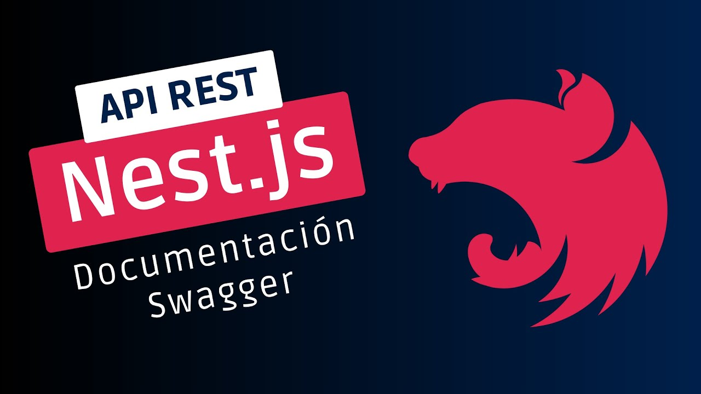

- [Configuración de CORS](#configuración-de-cors)
- [Documentación con Swagger](#documentación-con-swagger)
  - [Documentando los endpoints](#documentando-los-endpoints)
  - [Documentando los dtos](#documentando-los-dtos)
- [Práctica de clase: Swagger y OpenAPI](#práctica-de-clase-swagger-y-openapi)
- [Proyecto del curso](#proyecto-del-curso)



# Configuración de CORS
Los CORS son un mecanismo de seguridad que nos permite controlar el acceso a los recursos de nuestra API desde otros dominios. Por defecto, las peticiones a nuestra API desde otros dominios están bloqueadas por el navegador, por lo que debemos configurar CORS para permitir el acceso a nuestra API desde otros dominios.

Para ello configuramos estas opciones según nuestras necesidades:

```ts
@Module({})
export class CorsConfigModule implements NestModule {
  configure(consumer: MiddlewareConsumer) {
    consumer
      .apply((req, res, next) => {
        res.header('Access-Control-Allow-Origin', '*')
        res.header('Access-Control-Allow-Methods', 'GET, POST, PUT, DELETE')
        res.header(
          'Access-Control-Allow-Headers',
          'Origin, X-Requested-With, Content-Type, Accept',
        )
        next()
      })
      .forRoutes('*')
  }
}
```

# Documentación con Swagger
Para documentación de nuestra API, podemos usar Swagger, que nos permite generar una documentación de nuestra API de forma automática. Para ello, instalamos el paquete:

```bash
npm install --save @nestjs/swagger
```	

## Preparando la configuración de Swagger
Podemos preparar la configuración de Swagger en una función independiente, para ello creamos un módulo `swagger-config.module.ts`:

```ts
export function setupSwagger(app: INestApplication) {
  const config = new DocumentBuilder()
    .setTitle('API REST Tienda Nestjs DAW 2023/2024')
    .setDescription(
      'API de ejemplo del curso Desarrollo de un API REST con Nestjs para 2º DAW. 2023/2024',
    )
    .setContact(
      'José Luis González Sánchez',
      'https://joseluisgs.dev',
      'joseluis.gonzalez@iesluisvives.org',
    )
    .setExternalDoc(
      'Documentación de la API',
      'https://github.com/joseluisgs/DesarrolloWebEntornosServidor-03-2023-2024',
    )
    .setLicense('CC BY-NC-SA 4.0', 'https://joseluisgs.dev/docs/license/')
    .setVersion('1.0.0')
    .addTag('Productos', 'Operaciones con productos')
    .addTag('Storage', 'Operaciones con almacenamiento')
    .addTag('Auth', 'Operaciones de autenticación')
    .addBearerAuth() // Añadimos el token de autenticación
    .build()

  const document = SwaggerModule.createDocument(app, config)
  SwaggerModule.setup('api', app, document) // http://localhost:3000/api
}
```

Luego en el `main.ts` lo importamos y lo usamos:

```ts
async function bootstrap() {
  // Obtener las opciones de SSL
  const httpsOptions = getSSLOptions()
  const app = await NestFactory.create(AppModule, { httpsOptions })
  // Configuración de la versión de la API
  app.setGlobalPrefix(process.env.API_VERSION || 'v1')
  // Configuración de Swagger
  if (process.env.NODE_ENV === 'dev') {
    setupSwagger(app)
  }
  // Activamos las validaciones body y dtos
  app.useGlobalPipes(new ValidationPipe())
  // Configuración del puerto de escucha
  await app.listen(process.env.API_PORT || 3000)
}

// Inicialización de la aplicación y cuando esté lista se muestra un mensaje en consola
bootstrap().then(() =>
  console.log(
    `🟢 Servidor escuchando en puerto: ${
      process.env.API_PORT || 3000
    } y perfil: ${process.env.NODE_ENV} 🚀`,
  ),
)
```

## Documentando los endpoints

Si queremos que un endpoint no sea incluido en la documentación, podemos usar el decorador `@ApiExcludeEndpoint()`:

```ts
@Controller('pedidos')
@ApiExcludeController()
export class PedidosController {
  // ..
}
```

Podemos incluir la documentación de un endpoint con el decorador `@ApiTags()`:

```ts 
@Controller('productos')
@ApiTags('Productos') // Aplicar el decorador en el controlador
export class ProductosController {
  // ...
}
```

Si queremos documentar los parámetros de un endpoint, podemos usar el decorador `@ApiQuery()`:

```ts
@Get()
  @ApiResponse({
    status: 200,
    description:
      'Lista de productos paginada. Se puede filtrar por limite, pagina sortBy, filter y search',
    type: Paginated<ResponseProductoDto>,
  })
  @ApiQuery({
    description: 'Filtro por limite por pagina',
    name: 'limit',
    required: false,
    type: Number,
  })
  @ApiQuery({
    description: 'Filtro por pagina',
    name: 'page',
    required: false,
    type: Number,
  })
  @ApiQuery({
    description: 'Filtro de ordenación: campo:ASC|DESC',
    name: 'sortBy',
    required: false,
    type: String,
  })
  @ApiQuery({
    description: 'Filtro de busqueda: filter.campo = $eq:valor',
    name: 'filter',
    required: false,
    type: String,
  })
  @ApiQuery({
    description: 'Filtro de busqueda: search = valor',
    name: 'search',
    required: false,
    type: String,
  })
  async findAll(@Paginate() query: PaginateQuery) {
    this.logger.log('Find all productos')
    return await this.productosService.findAll(query)
  }
```

Si queremos documentar los parámetros de un endpoint, podemos usar el decorador `@ApiParam()`:

```ts
@Get(':id')
  @ApiResponse({
    status: 200,
    description: 'Producto encontrado',
    type: ResponseProductoDto,
  })
  @ApiParam({
    name: 'id',
    description: 'Identificador del producto',
    type: Number,
  })
  @ApiNotFoundResponse({
    description: 'Producto no encontrado',
  })
  @ApiBadRequestResponse({
    description: 'El id del producto no es válido',
  })
  async findOne(@Param('id', ParseIntPipe) id: number) {
    this.logger.log(`Find one producto by id:${id}`)
    return await this.productosService.findOne(id)
  }
```

Si queremos documentar los parámetros de un endpoint, podemos usar el decorador `@ApiBody()`:

```ts
@Post()
  @HttpCode(201)
  @UseGuards(JwtAuthGuard, RolesAuthGuard) // Aplicar el guard aquí
  @Roles('ADMIN')
  @ApiBearerAuth() // Indicar que se requiere autenticación con JWT en Swagger
  @ApiResponse({
    status: 201,
    description: 'Producto creado',
    type: ResponseProductoDto,
  })
  @ApiBody({
    description: 'Datos del producto a crear',
    type: CreateProductoDto,
  })
  @ApiBadRequestResponse({
    description:
      'El algunos de los campos no es válido según la especificación del DTO',
  })
  @ApiBadRequestResponse({
    description: 'La categoría no existe o no es válida',
  })
  async create(@Body() createProductoDto: CreateProductoDto) {
    this.logger.log(`Create producto ${createProductoDto}`)
    return await this.productosService.create(createProductoDto)
  }
```

Podemos indicar las excepciones o errores que puede devolver un endpoint con el decorador `@ApiBadRequestResponse()` o `@ApiNotFoundResponse()` u otros:

## Documentando los dtos

Podemos documentar los dtos con el decorador `@ApiProperty()`:

```ts
export class CreateProductoDto {
  @ApiProperty({
    example: 'Nike',
    description: 'La marca del producto',
    minLength: 3,
    maxLength: 100,
  })
  @IsString()
  @IsNotEmpty()
  @Length(3, 100, { message: 'El nombre debe tener entre 3 y 100 caracteres' })
  marca: string

  @ApiProperty({
    example: 'Air Max',
    description: 'El modelo del producto',
    minLength: 3,
    maxLength: 100,
  })
  @IsString()
  @IsNotEmpty()
  @Length(3, 100, { message: 'El nombre debe tener entre 3 y 100 caracteres' })
  modelo: string

  @ApiProperty({
    example: 'Zapatillas deportivas',
    description: 'La descripción del producto',
    minLength: 1,
    maxLength: 100,
  })
  @IsString()
  @IsNotEmpty()
  @Length(1, 100, { message: 'El nombre debe tener entre 1 y 100 caracteres' })
  descripcion: string

  @ApiProperty({
    example: 99.99,
    description: 'El precio del producto',
    minimum: 0,
  })
  @IsNumber()
  @Min(0, { message: 'El precio debe ser mayor que 0' })
  precio: number

  @ApiProperty({
    example: 10,
    description: 'El stock del producto',
    minimum: 0,
  })
  @IsNumber()
  @Min(0, { message: 'El stock debe ser mayor que 0' })
  stock: number

  @ApiProperty({
    example: 'https://example.com/imagen.jpg',
    description: 'La URL de la imagen del producto',
    required: false,
  })
  @IsOptional()
  @IsString()
  imagen?: string

  @ApiProperty({
    example: 'Calzado',
    description: 'La categoría del producto',
  })
  @IsString()
  @IsNotEmpty()
  categoria: string // No es el id, si no el nombre de la categoria
}
```

# Práctica de clase: Swagger y OpenAPI
1. Configura Swagger en tu proyecto
2. Documenta los modelos, DTOs y endpoints de tu API para el endpoint de funkos.

# Proyecto del curso
Puedes consultar esta parte en [el proyecto de ejemplo](https://github.com/joseluisgs/DesarrolloWebEntornosServidor-03-Proyecto-2023-2024/releases/tag/documentacion).

