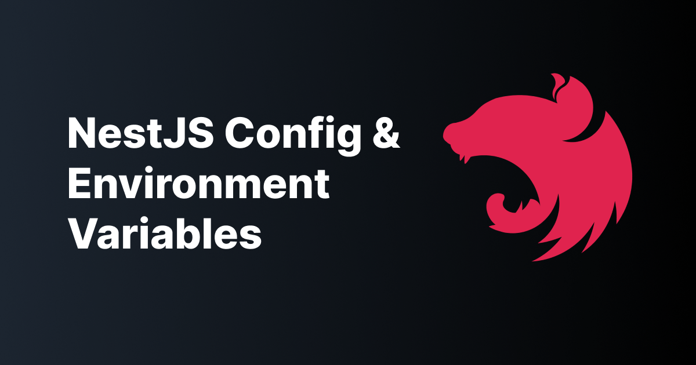

- [Perfiles](#perfiles)
  - [Perfil de desarrollo .env o env.dev](#perfil-de-desarrollo-env-o-envdev)
  - [Perfil de producción .env o env.prod](#perfil-de-producción-env-o-envprod)
  - [Ajustando la configuración de Nestjs](#ajustando-la-configuración-de-nestjs)
- [Cargando configuraciones](#cargando-configuraciones)
- [Práctica de clase: perfiles de desarrollo y producción](#práctica-de-clase-perfiles-de-desarrollo-y-producción)



# Perfiles
En Nestjs podemos usar los ficheros .env para gestionar distintos perfiles como desarrollo y producción. Gracias a @nestjs/config podemos gestionar estos perfiles de forma sencilla.

```bash
$ npm i --save @nestjs/config
```

## Perfil de desarrollo .env o env.dev

```bash
API_PORT=3000
API_VERSION=v1
DATABASE_USER=admin
DATABASE_PASSWORD=adminPassword123
POSTGRES_HOST=localhost
POSTGRES_PORT=5432
POSTGRES_DATABASE=tienda
MONGO_HOST=localhost
MONGO_PORT=27017
MONGO_DATABASE=tienda
NODE_ENV=dev
UPLOADS_DIR=storage-dir
TOKEN_SECRET=Me_Gustan_Los_Pepinos_De_Leganes_Porque_Son_Grandes_Y_Hermosos
TOKEN_EXPIRES=3600
SSL_KEY=./cert/keystore.p12
SSL_CERT=./cert/cert.pem
```

## Perfil de producción .env o env.prod

```bash
API_PORT=3000
API_VERSION=v1
DATABASE_USER=admin
DATABASE_PASSWORD=adminPassword123
POSTGRES_HOST=postgres-db
POSTGRES_PORT=5432
POSTGRES_DATABASE=tienda
MONGO_HOST=mongo-db
MONGO_PORT=27017
MONGO_DATABASE=tienda
NODE_ENV=dev
UPLOADS_DIR=storage-dir
TOKEN_SECRET=Me_Gustan_Los_Pepinos_De_Leganes_Porque_Son_Grandes_Y_Hermosos
TOKEN_EXPIRES=3600
SSL_KEY=./cert/keystore.p12
SSL_CERT=./cert/cert.pem
```

## Ajustando la configuración de Nestjs
Ahora podemos ajustar la configuración de Nestjs con ConfigModule

```typescript
@Module({
  imports: [
    // Lo primero es cargar la configuración de la aplicación y que esta esté disponible en el módulo raíz
    ConfigModule.forRoot(
      process.env.NODE_ENV === 'dev'
        ? { envFilePath: '.env.dev' || '.env' }
        : { envFilePath: '.env.prod' },
    ),
    // resto de cosas
  ],
  providers: [],
})
export class AppModule {}
```

# Cargando configuraciones

Una de las formas mas fáciles es creando las variables de entorno, pero si no quieres depender del sistema operativo puedes usar el paquete `cross-env` para ajustar el perfil

```bash
$ npm i --save-dev cross-env
```

Y en el package.json

```json
"scripts": {
    "build": "nest build",
    "format": "prettier --write \"src/**/*.ts\" \"test/**/*.ts\"",
    "start": "cross-env NODE_ENV=dev nest start",
    "start:dev": "cross-env NODE_ENV=dev nest start --watch",
    "start:debug": "cross-env NODE_ENV=dev nest start --debug --watch",
    "start:prod": "cross-env NODE_ENV=prod node dist/main",
    "lint": "eslint \"{src,apps,libs,test}/**/*.ts\" --fix",
    "test": "jest",
    "test:watch": "jest --watch",
    "test:cov": "jest --coverage",
    "test:debug": "cross-env NODE_ENV=dev node --inspect-brk -r tsconfig-paths/register -r ts-node/register node_modules/.bin/jest --runInBand",
    "test:e2e": "jest --config ./test/jest-e2e.json"
  },
```	

Y ahora podemos usar `process.env.NODE_ENV` para cargar el perfil de desarrollo o producción.

# Práctica de clase: perfiles de desarrollo y producción
1. Configura los perfiles de desarrollo y producción de tu servicio
2. Muestra el perfil activo al iniciar el servicio
3. Configura Swagger para que se ejecute en el perfil de desarrollo