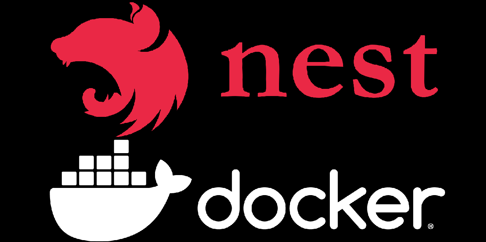

- [Desplegando el servicio en Node.js](#desplegando-el-servicio-en-nodejs)
  - [Desplegando con Docker](#desplegando-con-docker)
- [Práctica de clase: Despliegue](#práctica-de-clase-despliegue)
- [Proyecto del curso](#proyecto-del-curso)



# Desplegando el servicio en Node.js

Nuestra aplicación se va a desplegar cuando hacemos build y está situada en el directorio dist. Por tanto, para desplegarla en un servidor, debemos copiar el directorio dist y el fichero package.json. Para ello, podemos usar el comando `npm run build` que nos genera el directorio dist y copiarlo a nuestro servidor.

## Desplegando con Docker

Podemos desplegar con docker usando un Dockerfile multi-etapa. Para ello, creamos un fichero Dockerfile en la raíz de nuestro proyecto con el siguiente contenido:

```dockerfile
# Etapa de compilación, un docker especifico, que se etiqueta como build
FROM node:16-alpine AS build

# Directorio de trabajo
WORKDIR /app

# Copia el package.json
COPY package*.json ./

# Instala las dependencias con ci es mas rapido y optimizado para docker
# iestalamos todo porque vamos a hacer test, si no podríamos hacer npm ci --only=production
RUN npm ci

# Copia el resto de archivos del proyecto al directorio de trabajo
COPY . .

# Realiza los test
RUN npm run test

# Compila la aplicación
RUN npm run build

# Elimina las dependencias de prueba (devDependencies ya han pasado los test)
RUN npm prune --production

# Etapa de ejecución, un docker especifico, que se etiqueta como run
FROM node:16-alpine AS run

# Directorio de trabajo
WORKDIR /app

# Copia el node_modules
COPY --from=build /app/node_modules/ /app/node_modules/

# Copia el directorio build de la etapa de compilación
COPY --from=build /app/dist/ /app/dist/

# Copia el package.json
COPY package*.json /app/

# Expone el puerto 3000
EXPOSE 3000

ENTRYPOINT ["npm", "run", "start:prod"]
```

Ahora, podemos crear la imagen con el comando:

```bash
docker build -t mi-aplicacion .
```

Y ejecutarla con:

```bash
docker run -p 3000:3000 mi-aplicacion
```

Podemos usar Docker Compose si es necesario
  
```yaml
# Servicios de la aplicación
services:
  # Servicio de la API REST
  # comentar si no se quiere ejecutar en local o IDE
  tienda-api-rest:
    build:
      context: .
      dockerfile: Dockerfile
    container_name: tienda-api-rest
    restart: always
    env_file: .env.prod
    ports:
      - ${API_PORT}:3000
    volumes:
      - storage-dir:/app/storage-dir
      - ./cert:/app/cert
    networks:
      - tienda-network

# Volume para guardar los datos de la base de datos
volumes:
  storage-dir:

networks:
  tienda-network:
    driver: bridge
```	

También podemos usar un Docker Compose para generar todos los servicios necesarios, incluida nuestra API REST:

```yaml
# Lo necesario para ejecutar la aplicación en local
services:

  # PostgresSQL
  postgres-db:
    container_name: tienda-db_postgres
    image: postgres:12-alpine
    restart: always
    env_file: .env.prod
    environment:
      POSTGRES_USER: ${DATABASE_USER}
      POSTGRES_PASSWORD: ${DATABASE_PASSWORD}
      POSTGRES_DB: ${POSTGRES_DATABASE}
    ports:
      - ${POSTGRES_PORT}:5432
    volumes:
      - ./database/tienda.sql:/docker-entrypoint-initdb.d/tienda.sql
    networks:
      - tienda-network

  # MongoDB
  mongo-db:
    container_name: tienda-db_mongo
    image: mongo:5.0
    restart: always
    env_file: .env.prod
    environment:
      MONGO_INITDB_ROOT_USERNAME: ${DATABASE_USER}
      MONGO_INITDB_ROOT_PASSWORD: ${DATABASE_PASSWORD}
      MONGO_INITDB_DATABASE: ${MONGO_DATABASE}
    ports:
      - ${MONGO_PORT}:27017
    volumes:
      - ./database/tienda.js:/docker-entrypoint-initdb.d/tienda.js:ro
    networks:
      - tienda-network

  # Servicio de la API REST
  tienda-api-rest:
    build:
      context: .
      dockerfile: Dockerfile
    container_name: tienda-api-rest
    restart: always
    env_file: .env.prod
    ports:
      - ${API_PORT}:3000
    volumes:
      - storage-dir:/app/storage-dir
      - ./cert:/app/cert
    networks:
      - tienda-network
    depends_on:
      - postgres-db
      - mongo-db

# Volume para guardar los datos de la api rest, como las imágenes
volumes:
  storage-dir:

# Red para conectar los contenedores (opcional)
networks:
  tienda-network:
    driver: bridge
```

# Práctica de clase: Despliegue
1. Despliega completamente tu servicio usando docker, incluyendo las bases de datos necesarias para su funcionamiento. Ten en cuenta los perfiles dev y prod, para que puedas crear la imagen con uno y ejecutarla con otro.

# Proyecto del curso
Puedes consultar esta parte en [el proyecto de ejemplo](https://github.com/joseluisgs/DesarrolloWebEntornosServidor-03-Proyecto-2023-2024/releases/tag/despliegue).


